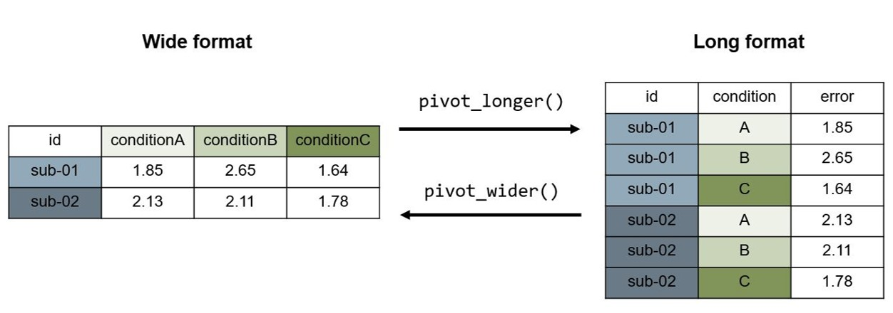

# Daten importieren und vorverarbeiten mit R

## Workflow

Zur Analyse von Daten gehören viele einzelne Schritte in _R_.
Um den Überblick zu behalten hilft es die wichtigsten Prozesse zu kennen.

- __Import__: Importieren des Datensatzes
-  __Tidy__: Bereinigen des Datensatzes (z.B. Identifizieren von fehlenden Werten)
- __Transform__: Transformieren des Datensatzes (z.B. Erstellen neuer Variablen, Umformattierung von _long_ zu _wide_)
- __Visualize__: Visualisieren des Datensatzes
- __Model__: Analysieren des Datensatzes (z.B. Ausführen eines _t_-Tests)
- __Communicate__: Kommunizieren der Daten, Analysen und Schlussfolgerungen

Das Transformieren, Visualisieren und Modellieren dient dazu, die Daten zu verstehen und daraus Schlussfolgerungen ziehen zu können.

![Wichtige Schritte im Data Science Prozess.^[Wickham, H., Çetinkaya-Rundel, M., Grolemund, G. (2025). R for Data Science (2e). https://r4ds.hadley.nz] ](../imgs/process_datawrangling.png){#fig-tidyverseworkflow}

::: {.callout-note appearance="default" title="Wollen Sie mehr darüber wissen?"}
Hier finden Sie das Buch [_R for Data Science_](https://r4ds.hadley.nz/)
:::

In R gibt es sehr viele hilfreiche _Funktionen_ und _Packages_, die für die Vorverarbeitung und Analyse neurowissenschaftlicher Verhaltensdaten (oder extrahierten Daten aus bildgebenden Verfahren) verwendet werden können. Beim Arbeiten in _R_ empfiehlt es sich durchgehend in einem _R-Script_, _RNotebook_ oder _R-Markdown_ Dokument (`.Rmd`) innerhalb eines _RStudio-Projects_ zu arbeiten, da so ein reproduzierbarer Workflow erstellt werden kann. Ein weiterer Vorteil ist zudem, dass Rohdaten __nicht__ verändert werden müssen. 

In diesem Kapitel finden Sie die wichtigesten data wrangling Funktionen des {tidyverse}-Packages:

- die Pipe: `|>`
- Daten einlesen: `read.csv()`
- Daten filtern: `filter()`
- Variablen auswählen: `select()`
- Variablen generieren/verändern: `mutate()`
- Variablentyp verändern: `as.factor()`, `as.numeric`
- Gruppieren und zusammenfassen: `group_by()`
- Datensätze speichern: `write.csv()`

{fig-align="center" width=50%}
[Illustration by Allison Horst](https://allisonhorst.com/everything-else)

<aside>Hilfreiche Datacamp Kurse:

- [RStudio Tutorial](https://www.datacamp.com/tutorial/r-studio-tutorial).

- [Introduction to the Tidyverse](https://app.datacamp.com/learn/courses/introduction-to-the-tidyverse).
</aside>


## Datenformate

Bevor mit einem Datensatz gearbeitet wird, empfiehlt es sich den Datensatz anzuschauen und Folgendes zu identifizieren:

- In welchem Dateiformat ist der Datensatz gespeichert? (z.B. in `.csv`, `.xlsx` oder anderen?)

- In welchem Datenformat ist der Datensatz geordnet? (`long` oder `wide` oder `mixed`?)

- Gibt es ein `data dictionary` mit Erklärungen zu den Variablen?


### _Long_-Format

Datensätze können im _Long_-Format und im _Wide_-Format formattiert sein.

- Jede Variable (jede gemessene Eigenschaft) entspricht einer Spalte (column)
- Jede Messung entspricht einer Zeile (row)

Wird eine Variable innerhalb einer Person mehrmals gemessen (z.B. error), dann hat jede Messung eine neue Zeile und die anderen Variablenwerte werden wiederholt (z.B. `id`).
Dieses Format eignet sich sehr gut für die Datenvisualisierung und für die Datenanalyse in R.

### _Wide_-Format

- Jede Einheit hat eine Zeile (row)
- Jede Messung entspricht einer Spalte (column)

Dieses Format eignet sich, um fehlende Werte schnell zu entdecken und um Daten einzugeben.


{fig-align="center" width=100%}


:::callout-caution
## Hands-on: Vorbereitung

1. Öffnen Sie RStudio.

2. Erstellen Sie ein neues _RStudio-Project_. 

    - Klicken Sie dafür auf `File` > `New Project` 
    
    - Benennen Sie das Project `complab_fs26` und speichern Sie es an einem sinnvollen Ort auf Ihrem Computer. Wählen Sie, dass dafür ein neuer Ordner erstellt werden soll.
    
3. Erstellen Sie in diesem Projekt-Ordner einen Ordner namens `data`.

4. Kopieren Sie in den `data`-Ordner Ihre erhobenen Daten des Stroop Experiments. Falls Sie noch keine Daten erhoben haben, dann laden Sie [hier](data/stroop_example.csv) einen Beispiels-Datensatz herunter und speichern Sie ihn im `data`-Ordner.

5. Erstellen Sie ein neues _RScript_ oder ein _RNotebook_ (`.Rmd`-File: `File` > `New File` > `RNotebook`) und speichern Sie dieses unter `intro_datawrangling` im Projekt-Ordner.
:::

:::callout-tip
## Tipp: Namensgebung für Files und Variablen

Wenn Sie Filenamen auswählen, achten Sie darauf dass diese [_machine-readable_](https://opendatahandbook.org/glossary/en/terms/machine-readable) sind:

- keine Lücken (verwenden Sie stattdessen den `camelCase`, den `snake_case` oder `-`)

- keine `ä`, `ö`, `ü` oder andere Sonderzeichen verwenden
:::

## Packages installieren und laden

Für das Bearbeiten der Daten verwenden eignen sich Funktionen aus dem _Package_ {tidyverse}, eine Sammlung von verschiedenen, für _data science_ sehr geeigneten _R Packages_. Funktionen aus dem {tidyverse} ermöglichen und vereinfachen viele Schritte der Datenverarbeitung. Im Folgenden werden die wichtigsten und häufigst verwendeten Funktionen beschrieben. Das {tidyverse} können Sie direkt in _R_ herunterladen:

<aside>Mehr Informationen zum {tidyverse} finden Sie [hier](https://r4ds.had.co.nz/).</aside>

```{r}
#| eval: FALSE
# Download und Installieren des Packages (nur einmal ausführen)
install.packages("tidyverse")
```

Ein _Package_ muss nur einmal heruntergeladen und __installiert__ werden, danach ist es lokal auf dem Computer gespeichert. Aber: Jedes Mal wenn _R_ geöffnet wird, müssen _Packages_ wieder neu __geladen__ werden.

```{r}
#| warnings: FALSE
#| errors: FALSE
#| output: FALSE
# Package laden (bei jedem Öffnen von R zu Beginn des Skripts ausführen)
library("tidyverse") 
```

Sobald ein _Package_ installiert ist, können die Funktionen auch verwendet werden ohne, dass das ganze _Package_ mit `library()` geladen wird, indem die Funktion mit dem _Package_-Namen zusammen aufgerufen wird: `packagename::packagefunction()`. Dies macht Sinn, wenn verschiedene _Packages_ dieselben Namen für verschiedene Funktionen nutzen und es so zu Konflikten kommt oder wenn nur eine Funktion aus einem _Package_ verwendet werden soll und alle anderen sowieso nicht gebraucht werden.

## Daten importieren in R: `read.csv()`

Einen Datensatz in `.csv`-Format kann mit der Funktion `read.csv()` importiert werden. Teilweise muss innerhalb der Klammer zusätzlich der _Separator_ mit `sep = ","` angegeben werden, also mit welchem Zeichen die Spalten getrennt sind. Normalerweise ist dies `,` in `.csv` (_comma separated values_), es kann aber auch `;`, `.` oder eine Lücke ` ` sein. 

```{r}
#| output: false
# Daten laden und anschauen
d_stroop <- read.csv("data/stroop_example.csv", sep = ",")
glimpse(d_stroop)
```

:::callout-caution
## Hands-on: Daten einlesen

Lesen Sie den Stroop Datensatz in Ihrem `data`-Ordner ein und schauen Sie ihn dann mit den Funktionen `glimpse()` und `head()` an.

- Welche Variablen sind wichtig für die weitere Auswertung?

- Welche braucht es wahrscheinlich nicht mehr?

- Finden Sie Versuchspersonenidentifikation? / Reaktionszeit? / Antwort der Versuchsperson?

:::

:::callout-tip
## Tipp: Daten anderer Formate einlesen

Falls Sie eine Excel-Datei einlesen möchten, können Sie dies mit der `read_excel()`-Funktion aus dem Package `readxl()` tun: `readxl::read_excel()`.

Falls Sie nicht wissen, mit welcher Funktion Sie Ihre Daten einlesen können, können Sie dies in _RStudio_ ausprobieren indem Sie beim Reiter `Environment` auf `Import Dataset` klicken und dort Ihren Datensatz auswählen oder über `File` > `Import Dataset`. Sie können dort diverse Einstellungen tätigen. In der _R Console_ können Sie dann den Code sehen, der zum Einlesen verwendet wurde und die dortige Funktion in Ihren Code kopieren.
:::

## Verwenden der Pipe: `|>` oder `%>%`

In _R_ können Sie die _Pipe_ verwenden um mehrere Datenverarbeitungsschritte aneinander zu hängen. Damit sparen Sie sich aufwändige Zwischenschritte und vermeiden das Erstellen von immer neuen Datensätzen. Statt zwei einzelne Datenverarbeitungsschritte zu machen wie oben, können mehrere Schritte (hier Daten einlesen und anzeigen) zusammengefasst werden, in dem nach Zeilenende eine _Pipe_ eingefügt wird:

<aside>Wann _Pipes_ ungeeignet sind wird [hier](https://r4ds.had.co.nz/pipes.html#when-not-to-use-the-pipe) beschrieben.</aside>

```{r}
#| eval: FALSE
d_stroop <- read.csv("data/stroop_example.csv", sep = ",") |>
    glimpse()
```

Die _Base R Pipe `|>` und die _`magritter` Pipe `%>%`_ unterscheiden sich in Details, in diesem Kapitel spielt es jedoch keine Rolle, welche Pipe Sie verwenden.

:::callout-tip
## Tipp

Achtung: Wenn wir zu Beginn ein `<-` oder `=` verwenden, wird alles was nach der Pipe kommt wird ebenfalls im Datensatz verändert. Wird z.B. der Code ...

```{r}
#| eval: FALSE
d_stroop <- read.csv("data/stroop_example.csv", sep = ",") |>
    head()
```

...eingegeben, besteht der Datensatz `d_stroop` dann nur noch aus 6 Zeilen, weil die Funktion `head()` den Datensatz auf die ersten 6 Zeilen kürzt.

Wird die Pipe ohne `<-` oder `=` verwendet, bleibt der Datensatz unverändert:

```{r}
#| eval: FALSE
d_stroop |>
    head()
```
::: 

## Daten filtern: `filter()`

Mit `filter()` können bestimmte Beobachtungen oder Untergruppen ausgewählt werden. Hierfür muss in der Funktion `filter(.data, filter, ...)` der Datensatz, die betreffende Variable, sowie eine Bedingung eingegeben werden. Es wird die ganze Zeile im Datensatz behalten in der die Variable der Bedingung entspricht.

_Beispiele:_

```{r}
#| eval: FALSE
# nur die Trials mit den rot angezeigten Wörtern behalten
d_stroop_filtered <- filter(d_stroop, color == "red")

# dasselbe mit der Pipe
d_filtered <- d_stroop |> filter(color == "red")

# nur Trials die ohne blau angezeigten Wörter behalten
d_filtered <- d_stroop |> filter(color != "blue")

# nur Übungstrials mit einer Antwortszeit unter oder gleich gross wie 1 Sekunde behalten
d_filtered <- d_stroop |> filter(respPractice.rt <= 1)

# nur Übungstrials mit Antwortzeiten zwischen 1 und 2 Sekunden behalten
d_filtered <- d_stroop |> filter(respPractice.rt > 1 & respPractice.rt < 2)

# mehrere Filter verwenden
d_filtered <- d_stroop |> 
    filter(color == "red") |>
    filter(respPractice.rt <= 1)
```

In unserem Datensatz möchten wir nur die gültigen Experimentdaten behalten, die _Color-To-Key_ (`ctk`) Bedingung sowie die _Practice Trials_ möchten wir ausschliessen. 

Die Variable `trials_test.thisN` enthält die Trialnummer, sie enthält nur Einträge, während der gültigen Trials. Wir können dies nutzen und alle Zeilen behalten in welchen die Zelle der Variable `trials_test.thisN` __nicht__ leer ist:

```{r}
#| output: false
d_stroop <- d_stroop |> 
    filter(!is.na(trials_test.thisN)) 
```


::: callout-caution
## Hands-on: Daten filtern

Erstellen Sie einen neuen Datensatz namens `d_stroop_correct` und filtern Sie diesen so dass er nur Trials mit __richtigen__ Antworten enthält. Schauen Sie in der Variable `keyResp_test_run.corr`, ob tatsächlich nur noch richtige Antworten übrig geblieben sind.

Achtung: Arbeiten Sie in den weiteren Schritten __nicht__ mit diesem Datensatz weiter, da wir die falschen Antworten in einem nächsten Schritt noch im Datensatz brauchen.
:::

## Variablen auswählen: `select()`

Ein komplexer Datensatz mit sehr vielen Variablen wird oft für die Analyse aus Gründen der Einfachheit oder Anonymisierung reduziert. Das bedeutet, dass man sich die nötigen Variablen herausliest, und nur mit diesem reduzierten Datensatz weiterarbeitet. Hierzu eignet sich die Funktion `select()` sehr gut: Mit `select(.data, variablenname, ...)` können die zu behaltenden Variablen ausgewählt werden. Wird ein `!` vor einen Variablennamen gesetzt, wird die Variable __nicht__ behalten.

Mit `select()` können wir auch die Variablen sortieren und umbenennen, damit unser Datensatz so strukturiert ist, wie wir ihn gebrauchen können.

_Beispiele:_

```{r}
#| eval: FALSE
# Variable word und color behalten ohne Pipe
d_simpler <- select(d_stroop, word, color)

# Variable word und color behalten mit Pipe
d_simpler <- d_stroop |> select(word, color)

# alle Variablen ausser word behalten
d_simpler <- d_stroop |> select(!word)

# Variablennamen verändern
d_simpler <- d_stroop |> select(newvariablename = word)
```

Sollen mehrere Variablen am Stück ausgewählt werden, kann man die erste Variable in der Reihe (z.B. `word`) und die letzte in der Reihe (z.B. `congruent`) als `word:congruent` eingeben, dann werden auch alle dazwischen liegenden Variablen ausgewählt.

::: callout-caution
## Hands-on: Variablen auswählen

Schauen Sie sich Ihren Datensatz an, welche Variablen benötigen Sie für die weitere Analysen?

Erstellen Sie einen neuen Datensatz `d_stroop_clean` in welchem Sie die entsprechenden Variablen auswählen und umbennen, wenn Sie Ihnen zu lange/kompliziert erscheinen.

Untenstehend finden Sie ein Beispiel, wie der Datensatz danach aussehen könnte.
:::


```{r}
#| echo: FALSE
d_stroop_clean <- d_stroop |>
    select(id = participant, 
           experiment = expName,
           trial = trials_test.thisN,
           word, 
           color, 
           corrAns,
           congruent,
           response = keyResp_test_run.keys,
           rt = keyResp_test_run.rt,
           accuracy = keyResp_test_run.corr
           )  |>
    glimpse()

```


## Neue Variablen generieren und verändern: `mutate()` und `case_when()`

Mit der `mutate(.data, …)` Funktion können im Datensatz neue Variablen generiert, bestehende Variablen verändert und bestehende Variablen gelöscht werden.

_Beispiel:_

```{r}
#| eval: FALSE
# Neue Variablen erstellen
d_new <- d_stroop_clean |>
    mutate(num_variable = 1.434,
           chr_variable = "1.434",
           sumofxy_variable = rt + 1,
           copy_variable = word)

# Bestehende Variablen verändern
d_new <- d_new |>
    mutate(num_variable = num_variable * 1000) # z.B. um Sekunden zu Millisekunden zu machen

# Bestehende Variablen löschen
d_new <- d_new |>
    mutate(copy_variable = NA) # z.B. um Sekunden zu Millisekunden zu machen
```

Mit `case_when()` kann eine neue Variable erstellt werden in Abhängigkeit von Werten anderer Variablen. Damit kann z.B. eine Variable `accuracy` erstellt werden, die den Wert `correct` hat, wenn die Aufgabe richtig gelöst wurde (z.B. Bedingung `rot` und Tastendruck `r`) und sonst den Wert `error` hat.

_Beispiel:_

```{r}
#| eval: FALSE
d_condvariable <- d_stroop_clean |>
    mutate(cond_variable = case_when(rt > 0.8 ~ "higher",
                                     rt <= 0.8 ~ "lower",
                                     .default = NA))
```

::: callout-caution
## Hands-on: Variablen generieren und verändern

- Erstellen Sie im Datensatz `d_stroop_clean` eine neue Variable mit dem Namen `researcher`, den Ihren Namen enthält.

- Erstellen Sie zudem eine Variable `accuracy_check`, mit `correct` für korrekte und `error` für inkorrekte Trials. Kontrollieren Sie mit der Variable `keyResp_test_run.corr` (oder Ihrem neuen Variablennamen, wenn Sie diese umbenannt haben) im Datensatz, ob Sie die Aufgabe richtig gelöst haben.

- Ändern Sie die Trialnummer, so dass sie nicht mehr mit 0 beginnt, sondern mit 1.
:::

## Variablenklasse verändern: `as.factor()`, `as.numeric()`, ...

Variablen können verschiedene Klassen haben, sie können z.B. kategoriale (`factor`, `character`) oder numerische (`integer`, `numeric`, `double`) Informationen enthalten. Beim Einlesen "rät" _R_, welche Klasse eine Variable hat. Teilweise möchten wir dies ändern. Wenn wir eine Variable zu einem Faktor machen möchten, verwenden wir `as.factor()`. Dies macht z.B. Sinn, wenn die Versuchspersonennummer als Zahl eingelesen wurde. Um von einem Faktor zu einer numerischen Variable zu kommen, verwenden wir `as.numeric()`.

```{r}
#| eval: false
# Die Variable "congruent" zu einem Faktor machen
d_stroop_clean |> 
    mutate(congruent = as.factor(congruent))
```

:::callout-caution
## Hands-on: Variablenklassen

Schauen Sie sich den Datensatz mit `glimpse()` oder mit `View()` an. Welche Klassen enthält Ihr Datensatz und was bedeuten Sie?

:::

<!-- #### `relevel()` -->

## Daten gruppieren und zusammenfassen: `group_by()` und `summarise()`

Mit diesen beiden Funktionen können wir mit wenig Code den Datensatz gruppieren und zusammenfassen.

```{r}
# Nach Wörter gruppieren
d_stroop_clean |> group_by(word) |>
    summarise(mean_rt = mean(rt),
              sd_rt = sd(rt))

```

:::callout-caution
## Hands-on: Daten zusammenfassen

Erstellen Sie einen neuen Datensatz `d_stroop_summary`

- Gruppieren Sie den Datensatz für Wortfarbe und Kongruenz.

- Fassen Sie für diese Gruppen die durchschnittliche Antwortzeit und Accuracy sowie die Standardabweichungen zusammen.

:::

## Datensätze speichern: `write.csv()`

```{r}
#| eval: false

write.csv(d_stroop_clean, file = "data/dataset_stroop_clean.csv", row.names = FALSE)

```


:::callout-caution
## Hands-on: Datensätze speichern

Speichern Sie einen neuen Datensatz mit den vorverarbeiteten Daten.

:::


<aside>Zu den gelernten Funktionen finden Sie hier [Grafiken](https://allisonhorst.com/r-packages-functions) die evtl. helfen, sich die Funktions-Namen zu merken.</aside>
