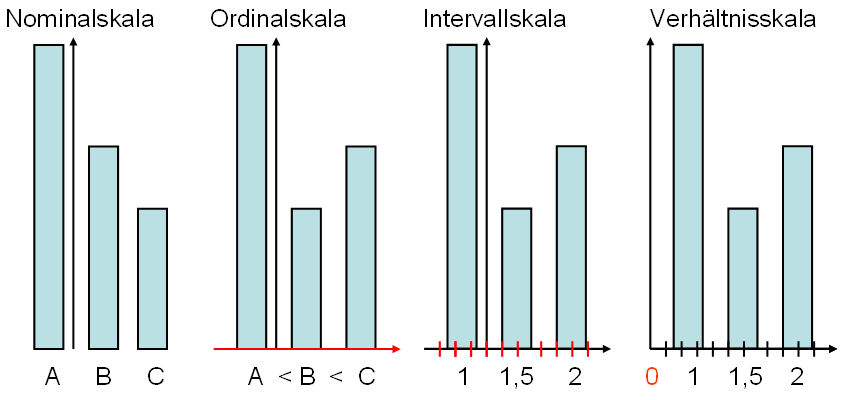

## Datenvisualisierung mit {ggplot2}

::: callout-caution
## Hands-on: Vorbereitung

- Erstellen Sie ein _RProject_ in _R_. Benennen Sie es passend.
- Laden Sie den Datensatz [hier](data/DatasaurusDozen.csv) herunter und speichern Sie diesen in dem Ordner `data` im Ordner Ihres _RProjects_.
- Öffnen Sie ein neues RScript (`.R`) oder RMarkdown-File (`.Rmd`). 

<aside>In einem RMarkdown-File können Code und Text verbunden werden und die die Outputs des Codes (z.B. Grafiken) werden anzeigt.</aside>
:::

Das `gg` im _Package_ {ggplot2} und der Funktion `ggplot()` steht für __*Grammar of Graphics*__. 
Diese besagt, dass alle Grafiken aus definierten Komponenten zusammengesetzt werden können und sich damit vollständig beschreiben lassen. 
Das Kennen dieser Komponenten macht den anfangs oft etwas unintuitiven Aufbau von {ggplot2} verständlicher.

<aside>Mit {ggplot2} könnte man sogar Kunstwerke erstellen, wie bspw. [hier](https://www.data-imaginist.com/art) gezeigt wird.</aside>

Eine Grafik enthält mindestens folgende 3 Komponenten: 

-   **Daten**

-   **Geome**: sichtbare Formen (*aesthetics*), z.B. Punkte, Linien oder Boxen.

-   **Koordinatensystem/Mapping**: Verbindung von Daten und Geomen.


Weitere optionale Komponenten sind:

-   Statistische Parameter

-   Positionen

-   Koordinatenfunktionen

-   **Facets**

-   Scales

-   **Themes**

In dieser Einführung wird auf die ersten drei Komponenten, sowie auf _Facets_ und _Themes_ eingegangen.

Beim Laden des _Packages_ `tidyverse` wird automatisch das _Package_ {ggplot2} geladen.

```{r}
#| message: false
#| warning: false
library(tidyverse)
```


## Daten
 
Die wichtigste Komponente einer Grafik sind die Daten. Bevor eine Grafik erstellt wird, müssen die Eigenschaften des Datensatzes bekannt sein. 

<aside>Der verwendete Datensatz stammt von @matejka_same_2017. </aside>

```{r}
# Einlesen des Datensatzes
d <- read.csv("data/DatasaurusDozen.csv") %>%
    mutate(condition = as.factor(condition)) # Variable condition zu Faktor konvertieren

# Datensatz anschauen
glimpse(d)
```

### Datenformat

Am einfachsten ist das Plotten mit `ggplot()`, wenn die Daten im *long*-Format vorliegen. Das bedeutet:

- Jede Variable die gemessen/erhoben wird, hat eine Spalte (z.B. Versuchspersonennummer, Reaktionszeit, Taste). 

- Jede Messung hat eine Zeile. (In unserem PsychoPy-Experiment entspricht dies einer Zeile pro Trial.)

Die hier eingelesenen Daten sind schon im *long*-Format. 

<aside> Falls die Daten im *wide*-Format abgespeichert sind, lohnt es sich diese umzuformatieren z.B. mit `pivot_longer()`. </aside>


### Variablen

Für die Grafik ist es relevant, welches Skalenniveau die zu visualisierenden Variablen haben. Je nach Anzahl Variablen und den entsprechenden Skalenniveaus eignen sich andere Grafik-Formate. Eine häufige Schwierigkeit beim Visualisieren der Daten ist, dass die Daten nicht das für den gewählten Plot passenden Skalenniveaus haben.

{fig-align="center" width=50%}

::: callout-caution
## Hands-on: Datensatz anschauen

Schauen Sie sich den Datensatz an. 

- Wie viele unterschiedliche Variablen gibt es? 
- Wie heissen die Variablen? 
- Welches Skalenniveau haben sie?

:::

### Subsetting

Wenn nur ein gewisser Teil der Daten visualisiert werden soll, muss der Datensatz gefiltert werden. 
Der aktuelle Datensatz enthält beispielsweise verschiedene Bedingungen, jeweils mit Werten für Variable `value1` und `value2`. Folgende 13 Bedingungen sind enthalten:

```{r}
unique(d$condition)
```

Fürs erste entscheiden wir uns für die Bedingung `away`.

```{r}
d_away <- d %>%
    filter(condition == "away")
```


Wir können für diese Bedingung zusätzlich *summary statistics* berechnen, hier Mittelwert und Standardabweichung.

```{r}
d_away_summary <- d_away %>%
    summarise(mean_value1 = mean(value1),
              sd_value1 = sd(value1),
              mean_value2 = mean(value2),
              sd_value2 = sd(value2))

glimpse(d_away_summary)
```

Diese Werte geben einen Anhaltspunkt, in welchem Bereich sich die Werte bewegen werden. 

### Plot
In den folgenden Beispielen werden die Daten der Bedingung `away` verwendet. 
Als erstes Argument wird der Funktion `ggplot()` der Datensatz übergeben (`data = data_away`).

```{r}
ggplot(data = d_away)
```


## Mapping

Das `mapping` beschreibt, welche Variable auf der _X_- und _Y_-Achse abgetragen werden sollen. 
Es wird also definiert, wie die Variablen auf die Formen (*aesthetics*) gemappt werden sollen. 
Am einfachsten wird dies zu Beginn in festgelegt (das `mapping` kann aber auch in der Funktion `geom_` selbst definiert werden). 
Weitere Variablen könnten als Argumente z.B. unter `group = ...` oder `color = ...` eingefügt werden.

```{r}
ggplot(data = d_away,
       mapping = aes(x = value1,
                     y = value2)) 
```

Die Grafik verfügt nun über Achsen, diese werden automatisch mit den Variablennamen beschriftet. 
Da noch keine Formen (`geoms`) hinzugefügt wurde ist die Grafik in der Mitte aber leer. 

## Geom / Formen

Als dritte Komponente wird in `ggplot()` die Form mit `geom_` hinzugefügt. 
Jede Form, die eingefügt wird, benötigt Angaben zum `mapping`.
Falls kein `mapping` angegeben wird, wird dieses aus der `ggplot()`-Funktion in der ersten Zeile übernommen. 

Es stehen viele verschiedene Formen zur Auswahl. 
Beispielsweise werden mit `geom_point()` Punkte erstellt, mit `geom_line()` Linien, mit `geom_boxplot` Boxplots, usw. 
Bei der Wahl der passenden Form kommt es einerseits auf die Daten an. 
Sind die Daten z.B. Faktoren oder numerische Werte (siehe auch Skalenniveau oben)? 
Wie viele Variablen werden gleichzeitig in die Grafik eingebunden? 
Andererseits ist es wichtig, was mit der Grafik gezeigt werden soll: Unterschiede? Gemeinsamkeiten? Veränderungen über Zeit? 

Geome zur Visualisierung von Datenpunkten und Verläufen:

- Punkte / Scatterplots - `geom_point()`
- Linien - `geom_line()`

Geome zur Visualisierung von zusammenfassenden Werten:

- Histogramme - `geom_histogram()`
- Mittelwerte und Standardabweichungen - `geom_pointrange()`
- Dichteplots - `geom_density()`
- Boxplots - `geom_boxplot()`
- Violinplots - `geom_violin()`

<aside>Es gibt auch weitere, sehr informative Arten der Visualisierung, wie *heat maps* oder *shift functions*, auf die wir in dieser Veranstaltung nicht eingehen.</aside>

::: callout-caution
## Hands-on: Geoms

Welche `geoms` eignen sich für welches Skalenniveau und welche Variablenanzahl?

_Tipps:_

- Schauen Sie sich den Datensatz mit `glimpse()`, `head()` oder `summary()` an.
- Schauen Sie sich die verschiedenen Formen von Plots [hier](https://www.data-to-viz.com) an.
<!-- - Installieren Sie das _Package_ {esquisse} mit `install.packages("esquisse") und geben Sie `esquisse::esquisser()` in die Konsole ein. Wählen Sie den Datensatz __`d_away` aus. Welche `Geoms` werden Ihnen vorgeschlagen? -->

👉 [`{ggplot2}-Cheatsheet zum Herunterladen](https://github.com/rstudio/cheatsheets/blob/main/data-visualization.pdf)
:::

### Kombinieren von mehreren `geoms` in einer Grafik

Teilweise werden in Visualisierungen mehrere `geoms` kombiniert. 
In vielen Fällen macht es beispielsweise Sinn, nicht nur die Rohwerte oder Werte für jedes Subjekt, sondern in derselben Grafik auch zusammenfassende Masse, z.B. einen Boxplot, zu visualisieren.

<aside>Weiterführende Info zum Kombinieren von Plots finden Sie [hier](https://psyteachr.github.io/reprores-v3/ggplot.html#combo_plots).</aside>

Verwenden verschiedener `geoms` in einem Plot:

```{r}
ggplot(data = d_away, 
       mapping = aes(x = condition,
                     y = value2)) +
    geom_boxplot(width = 0.3) +
    geom_jitter(width = 0.1) 

```

Kombiniert werden können aber nicht nur verschiedene Formen, sondern auch mehrere Datensätze. 
Dies kann in `ggplot()` einfach umgesetzt werden indem mehrere _Geoms_ übereinandergelegt werden und nicht das `mapping` aus der `ggplot()`-Funktion genutzt wird. 
Stattdessen wird für jedes `geom` ein separater Datensatz und ein separates `mapping` spezifiziert.

```{r}
ggplot(data = d_away, 
       mapping = aes(x = condition,
                     y = value2)) +
    geom_jitter(width = 0.1) + # verwendet Datensatz "d_away"
    geom_point(data = d_away_summary, # verwendet Datensatz "d_away_summary"
               aes(x = "away", y = mean_value1), # condition ist nicht im Datensatz enthalten, deshalb hier hardcoded
               color = "red", # Punkt rot einfärben
               size = 3) # Punkt vergrössern
```


## Beschriftungen und Themes

Schönere und informativere Plots lassen sich gestalten, wenn wir einen Titel hinzufügen, die Achsenbeschriftung anpassen und das `theme` verändern:

```{r}
ggplot(data = d_away,
       mapping = aes(x = value1,
                     y = value2)) +
    geom_point() +
    labs(title = "Ein etwas schönerer Plot", 
         subtitle = "Verteilung der Rohwerte",
        x = "Wert 1  [a.u.]",
        y = "Wert 2 [a.u.]") +
    theme_minimal()
```

<aside> Auch `theme_classic()` oder `theme_bw()` ergeben schlichte aber schöne Plots. </aside>

:::{.callout-caution}
## Hands-on

Erstellen Sie eine Grafik. 

- Fügen Sie mit `labs()` passende Beschriftungen hinzu. Gibt es noch weitere, oben nicht verwendete Optionen? 
- Wechseln Sie das `theme`. Welches gefällt Ihnen am besten?

    - `theme_bw()`
    - `theme_classic()`
    - `theme_dark()`
    - ... (schreiben Sie `theme_` und drücken Sie `Tab`, um weitere Vorschläge zu sehen.)

:::

## Daten plotten: Tipps und Tricks

::: callout-caution
## Hands-on: Informative Grafik erstellen

Im Folgenden können Sie den Datensatz mit Grafiken erkunden. 

Sie können entweder in Ihrem _RScript_ / _RMarkdown_ weiterarbeiten oder Sie können ein GUI (graphical user interface) verwenden, dass für Sie den Code schreibt.

- Welche `geom_`s/Formen eignen sich gut für diesen Datensatz? 

- Welche Abbildungen können alle 3 Variablen des Datensatzes berücksichtigen?

- Wie kann man Bedingungen miteinander vergleichen?

- Wie können Grösse und Farbe der `geom_`s bestimmt werden?

- Wie passt man Schriftgrössen an?

- Können Sie eine Grafik speichern?

- Lassen Sie sich den Code direkt ins _RScript_ / _RNotebook_ einfügen und verändern Sie den Code dort weiter.

:::

### Daten plotten mit `esquisser()`

Um in _RStudio_ ein GUI für das Datenvisualisieren zu verwenden, kann das _Package_ {esquisse} genutzt werden.

- Installieren Sie das _Package_ {esquisse} mit `install.packages("esquisse")` in der Konsole oder über `Tools` > `Install packages...`

- Geben Sie in Ihrer Konsole `esquisse::esquisser()` ein und wählen Sie dann unter `Import Data` den schon eingelesenen Datensatz `DatasaurusDozen.csv` aus.


<aside>Ein weiteres `R`-basiertes Visualisierungstool in welchem der Code per GUI erstellt wird, ist [trelliscopejs](https://hafen.github.io/trelliscopejs/)</aside>


### Mehrere Plots in einer Grafik darstellen

Dies können Sie mit dem Package `{patchwork}` sehr einfach machen. 

<aside>Wenn Sie das _Package_ `{patchwork}` zum ersten Mal nutzen, können Sie es in der Konsole mit `install.packages("patchwork")` installieren. </aside>

```{r}
library(patchwork)
p1 <- ggplot(data = d_away,
       mapping = aes(x = value1,
                     y = value2)) +
    geom_point() +
    labs(title = "Plot A", 
         subtitle = "Verteilung der Rohwerte",
        x = "Wert 1  [a.u.]",
        y = "Wert 2 [a.u.]") +
    theme_minimal()

p2 <- ggplot(data = d_away,
       mapping = aes(x = value1,
                     y = value2)) +
    geom_point() +
    labs(title = "Plot B", 
         subtitle = "Verteilung der Rohwerte",
        x = "Wert 1  [a.u.]",
        y = "Wert 2 [a.u.]") +
    theme_minimal()

p1 + p2

```
Oder auch untereinander

```{r}
p1 / p2
```


### Grafik abspeichern

Eine Grafik lässt sich abspeichern unter dem Reiter `Plots` > `Export` oder mit der Funktion `ggsave()`.

### Wieso ist Plotten so wichtig?

Studiendaten können wichtige Informationen enthalten, die ohne Grafiken übersehen werden können (vgl. Rousselet, Pernet und Wilcox, 2017). 
Das Visualisieren der Rohdaten kann Muster zum Vorschein bringen, die durch statistische Auswertungen nicht sichtbar sind. 
Die Wichtigkeit von Datenvisualisierung für das Entdecken von Mustern in den Daten zeigte Francis Anscombe 1973 mit dem *Anscombe's Quartet*. 
Dies diente als Inspiration für das Erstellen des "künstlichen" Datensatzes `DatasaurusDozen`, welchen wir in der letzten Veranstaltung visualisiert haben. 
Verschiedene Rohwerte, können dieselben Mittelwerte, Standardabweichungen und Korrelationen ergeben. 
Nur wenn man die Rohwerte plottet erkennt man, wie unterschiedlich die Datenpunkte verteilt sind.

Dies wird ersichtlich, wenn wir die Mittelwerte und Standardabweichungen für jede Gruppe berechnen und plotten:

```{r}
#| message: false
#| warning: false
# load DatasaurusDozen dataset
dino_data <- read.csv("data/DatasaurusDozen.csv") %>%
    mutate(condition = as.factor(condition))

# Plot mean and standard deviation for value 1 per condition 
dino_data |>   
    group_by(condition) |>
    summarise(mean_value1 = mean(value1),
              sd_value1 = sd(value1)) |>
    ggplot(mapping = aes(x = mean_value1,
                     y = condition)) +
    geom_point() +
    geom_errorbar(aes(xmin = mean_value1 - sd_value1, 
                      xmax = mean_value1 + sd_value1), 
                  width = 0.2) +
    theme_minimal()

```

Und dann die Rohwerte visualisieren:

```{r}
#| message: false
#| warning: false
# Plot raw values
dino_data |> 
    ggplot(aes(x = value1, y = value2)) +
    geom_point(size = 1) +
    facet_wrap(~condition) +
    theme_minimal()

```

Hier sehen Sie das Ganze animiert:

](https://damassets.autodesk.net/content/dam/autodesk/research/publications-assets/gifs/same-stats-different-graphs/DinoSequentialSmaller.gif)


### Inspiration

- Grafiken für verschiedene Datenarten: [From Data to Viz](https://www.data-to-viz.com) 

- Simple bis crazy Chartideen: [R Charts: Ggplot](https://r-charts.com/ggplot2)

- Farben für Grafiken: [R Charts: Colors](https://r-charts.com/colors), [noch mehr Farben](https://www.datanovia.com/en/blog/ggplot-colors-best-tricks-you-will-love)


### Weiterführende Ressourcen zur Datenvisualisierung mit `ggplot()`

- [Dokumentation](https://ggplot2.tidyverse.org/) von `ggplot2`

- Kurzweilige, kompakte und sehr informative Informationen und Videos über das Erstellen von Grafiken in `ggplot` finden Sie hier: [Website PsyTeachR: Data Skills for reproducible research](https://psyteachr.github.io/reprores-v3/ggplot.html3)

- [Hier](https://youtu.be/90IdULVGmYY) ist der Start der PsyTeachR Videoliste von Lisa deBruine, dort finden sich auch hilfreiche Kurzvideos zu Themen von Daten einlesen bis zu statistischen Analysen. Beispielsweise zu [Basic Plots](https://youtu.be/tOFQFPRgZ3M), [Common Plots](https://youtu.be/kKlQupjD__g) und [Plot Themes and Customization](https://youtu.be/6pHuCbOh86s)

- [Einführung in R](https://methodenlehre.github.io/einfuehrung-in-R/chapters/05-plotting.html) von Andrew Ellis und Boris Mayer

