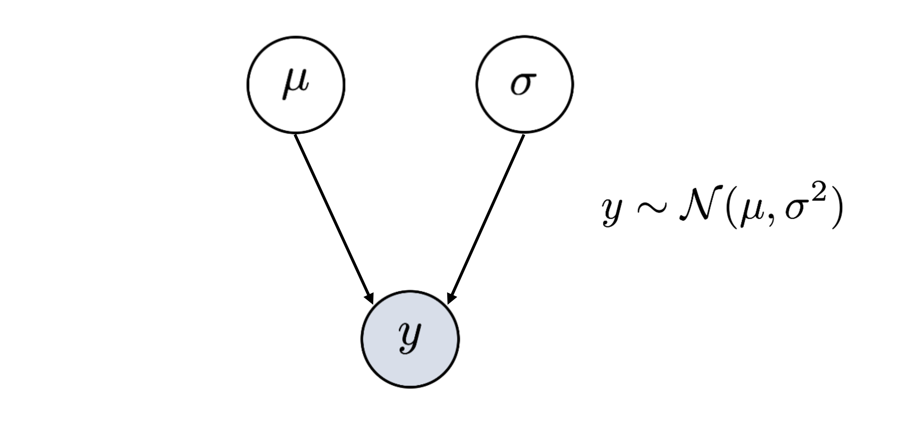
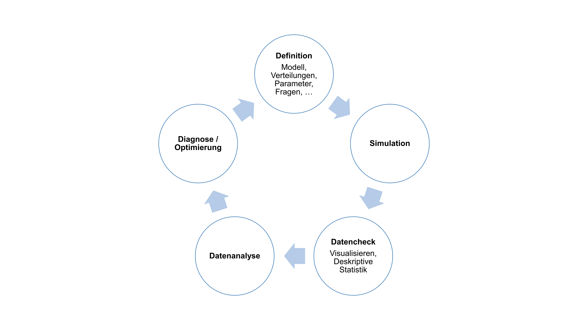

# Datengenerierende Prozesse

Nach dem Data Cleaning und Preprocessing interessiert es nun, welche Informationen die Daten über den zu untersuchenden Prozess beinhalten. 
Anhand der Daten sollen also Rückschlüsse auf den _datengenerierenden Prozess_, der zu diesen Daten geführt hat gezogen werden. 

Bei jeder Datenanalyse müssen zahlreiche Annahmen getroffen werden. 
Um diese explizit zu machen und auch die Datenanalyse zu planen, hilft eine grafische Darstellung. 
Directed Acyclic Graphs (DAGs) sind eine praktische und sehr informative Variante hierfür.

## Directed Acyclic Graphs (DAGs)

Ein DAG (_directed acyclic graph_) eignet sich für die Darstellung komplexer Zusammenhänge in Daten und Prozessen. 
Mit einem DAG kann veranschaulicht werden, welche Variablen welche anderen Variablen beeinflussen. 
Die Kreise (_nodes_) werden für einzelne Elemente verwendet. 
Die Pfeile (_arrows_ oder _edges_) beschreiben die Beziehung zwischen den Elementen. 
Die Darstellung beschreibt einen Prozess also mit gerichteten (_directed_) und nicht zyklischen (_acyclic_) Beziehungen.

_Wir können beispielsweise annehmen, dass die Anwesenheit eines Stimulus in unserem Kursexperiment zu schnelleren Reaktionszeiten führen._

Ein DAG kann mit folgenden Schritten erstellt werden:

### 1. Schritt: Beobachtete Variable bestimmen

Die beobachtete Variable nennen wir hier $y$. Der Kreis ist grau eingefärbt, weil die Werte in dieser Variable gemessen wurden bzw. bekannt (beobachtet) sind.

_In unserem Beispiel haben wir die Reaktionszeit gemessen. Im Datensatz enthält die Variable `rt` die Information, wie schnell eine Person in jedem Trial geantwortet hat._

### 2. Schritt: Verteilung bestimmen

Für statistische Tests muss festgelegt werden, welche Verteilung die Daten $y$ am besten beschreibt. 
Die gewählte Verteilung ist immer __nur eine Annäherung__.
Die beocbachteten/gemessenen Daten entsprechen dieser Annahme eigentlich nie perfekt. 
Es geht hier darum eine Verteilung zu finden die _gut genug_ zu den Daten passt, um statistische Verfahren anzuwenden.


:::callout-caution

## Hands-on: Weshalb müssen wir eine Verteilung annehmen?

Diskutieren Sie kurz untereinander: 

- Weshalb wollen wir eine Verteilung annehmen, um unsere Daten zu beschreiben? 

- Muss immer eine Verteilung angenommen werden, wenn statistische Tests angewendet werden?
    
_[5 Minuten]_
:::

Jede Verteilung hat Parameter, die geschätzt werden können. 
Es gibt Verteilungen, welche durch einen Parameter definiert werden, andere brauchen mehrere Parameter.

Eine sehr häufig verwendete Verteilung in statistischen Analysen ist die Normalverteilung. 
Die Annahme einer Normalverteilung ermöglicht es uns, mit nur 2 Parametern die Daten in der Variable  zu beschreiben: Dem Mittelwert ($\mu$) und der Standardabweichung ($\sigma$).
Natürlich ist das nur eine Annäherung, aber meistens eine genügend Gute! 

<aside>Hier im [Distribution Zoo](https://ben18785.shinyapps.io/distribution-zoo/) werden Verteilungen, zugrundeliegende Daten sowie Code und Formeln zusammengefasst.</aside>

{fig-align="center" width=80%}

::: {.callout-note appearance="simple"}

### Kursdaten herunterladen

[Hier](data/data_dijkstra_course.csv) finden Sie die Daten zum herunterladen.

Lesen Sie anschliessend die Daten ein:

```{r message = FALSE, warning = FALSE}
## Daten einlesen
library(tidyverse)
d <- read_csv("data/data_dijkstra_course.csv") |>
    mutate(across(where(is.character), as.factor)) |> # zu Faktoren machen
    na.omit() # Messungen mit missings weglassen
```
:::

Um die Verteilung unserer Datenpunkte zu bestimmen bzw. zu überprüfen können die Daten in _R_ geplottet werden, z.B. mit `geom_histogram()`. Das Argument `binwidth =` bestimmt, wie breit ein Balken wird (hier 50 ms).

```{r}
d |>
    ggplot(aes(x = rt)) +
    geom_histogram(colour="black", fill = "white", 
                   binwidth = 0.05, 
                   alpha = 0.5) +
    theme_minimal()
```
Diese Verteilung könnte beispielsweise mit einer Normalverteilung beschrieben werden. Der Mittelwert und die Standardabweichung können wir mit _R_ berechnen:

```{r}
# clean dataset first
mu = mean(d$rt)
mu

sigma = sd(d$rt)
sigma
```
Um zu schauen, wie gut diese Normalverteilung mit den Parametern $\mu$ = `r mu` und $\sigma$ = `r sigma` unsere Daten beschreibt, können wir die Daten und simulierte Daten mit der angenommenenen Verteilung übereinander plotten:


```{r}
d |>
    ggplot(aes(x = rt)) +
    geom_histogram(colour="black", fill = "white", 
                   binwidth = 0.05, 
                   alpha = 0.5) +
    geom_histogram(aes(x = rnorm(1:length(rt), mu, sigma)),
                   binwidth = 0.05,
                   alpha = 0.2) +
    theme_minimal()
```

Wir können auch `density`-Plots dafür nutzen:

```{r}
d |>
    ggplot(aes(x = rt)) +
    geom_density(colour="black", fill = "white") +
    geom_density(aes(x = rnorm(1:length(rt), mu, sigma)),
                 fill="grey",
                 alpha = 0.2) +
    theme_minimal()
```

:::callout-caution

## Hands-on: Verteilungen

- Welche Daten stammen aus unseren Daten, welche entsprechen der Normalverteilung $N(0.629, 0.495)$ ?

- Wie gut passt die Annahme der Normalverteilung für unsere Reaktionszeitdaten? Wo passt sie gut? Wo nicht?

- Finden Sie eine passendere Verteilung auf [Distribution Zoo](https://ben18785.shinyapps.io/distribution-zoo/)? 

- Prüfen Sie Ihre Verteilung, indem Sie unten an den obigen Plot diese Verteilung mit gewählten Parametern folgenden Code einfügen.

    - Wählen Sie dazu eine Verteilung und passende Parameter auf Distribution Zoo aus.
    
    - Schauen Sie unter dem Reiter `Code` mit welcher Funktion die Daten in `R` generiert werden können. Wählen Sie `Language: R` und `Property: random sample of size n` aus. 
    
    - Kopieren Sie die Funktion und ersetzen Sie `rnorm(1:length(rt), mu, sigma)` in unserem R-Code für das Histogram oder den Density-Plot mit Ihrer neuen Funktion. Das `n` müssen Sie wieder `1:length(rt)` nennen.
    
    - Wie gut überlappen sich die beiden geplotteten Verteilungen?
    
_[10 Minuten]_
:::

Bei Reaktionszeiten ist die Verteilung gar nicht so einfach anzupassen: [Hier](https://lindeloev.shinyapps.io/shiny-rt) finden Sie "besser" geeignete Verteilungen, sowie die Möglichkeit für einen vorgegebenen Datensatz oder Ihre eigenen Daten Parameterwerte anzupassen.

### 3. Schritt: Hinzufügen weiterer Einflussfaktoren

In einem DAG können auch weitere Informationen, zum Beispiel Bedingungen sowie Messwiederholungen, hinzugefügt werden. 

_$\mu$ kann sich zum Beispiel in Abhängigkeit der Bedingung (`congruency`) verändern, also je nachdem ob die angezeigte Stimulus kongruent mit dem vorgestellten Stimulus war oder nicht._

Wenn wir nun den Einfluss der Bedingung untersuchen möchten, könnten wir uns fragen, wie stark diese eine Veränderung im Wert $\mu$ bewirkt. Genau dies tun wir z.B. bei Mittelwertsvergleichen wie z.B. bei _t_-Tests.

:::callout-caution

## Hands-on: DAG zeichnen

Wie würde ein DAG für die `accuracy` (Korrektheit) der Daten womöglich aussehen?

Gehen Sie wie folgt vor:

- Was ist bekannt/wurde gemessen? 

- Welche Verteilung beschreibt die Daten gut?

- Welche Parameter müssen geschätzt werden?

_[5 Minuten]_
:::

## Datensimulation

Sich Gedanken zum datengenerierenden Prozess zu machen (wie beispielsweise mit einem aufgezeichneten Modell) hilft nicht nur in der Planung der Datenanalyse, sondern ermöglicht u.a. auch das Simulieren von Daten.


__Mögliche Schritte in der Datensimulation__
{fig-align="center" width=100%}

<aside>[Shiny-App für Datensimulation](https://shiny.psy.gla.ac.uk/debruine/fauxapp/)</aside>

Datensimulation ist nützlich für:

- Die Vorbereitung von Präregistrationen und Registered Reports

- Testen/Debugging von statistischen Verfahren und Analysekripten (weil die _ground truth_ bekannt ist)

- Power für komplexe Modelle schätzen

- Erstellen von reproduzierbaren Beispielsdatensätzen (für Demos, Lehre, oder wenn echte Datensätze nicht veröffentlicht werden können)

- Prior distribution checks in der Bayesianischen Statistik

- Verstehen von Modellen und Statistik

<aside>[Weitere Infos](https://debruine.github.io/talks/EMPSEB-fake-it-2023) zu Datensimulation</aside>


Um Hypothesen zu testen, müssen selbstverständlich echte, __nicht simulierte__ Daten erhoben werden! 
