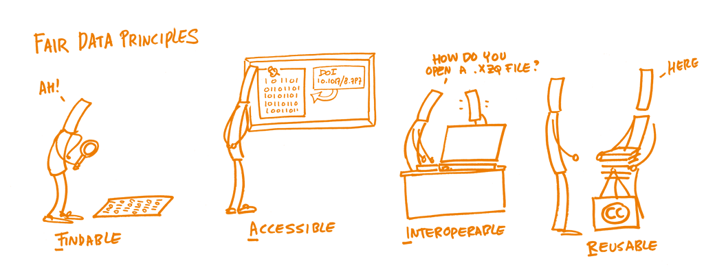
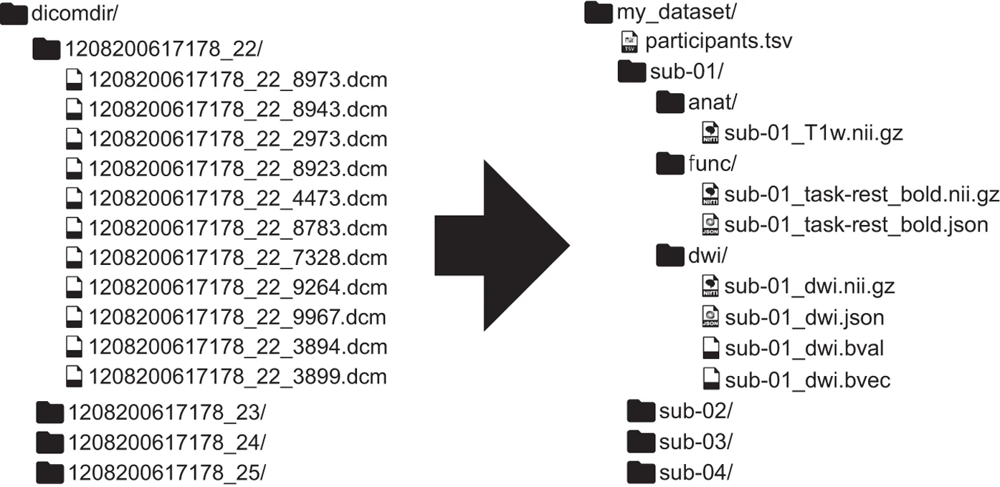

# Good Practices in der Datenverarbeitung

In der neurowissenschaftlichen Forschung werden zunehmend sehr grosse und komplexe Datensätze generiert. Daten aus unterschiedlichen Datenerhebungsverfahren sollen miteinander verknüpft (aggregiert) werden, um neue Erkenntnisse zu gewinnen. Eine sehr häufige Kombination sind beispielsweise Verhaltens- und Bildgebungsdaten, wie es in vielen fMRI-Studien der Fall ist. Das erfordert Kenntnisse der unterschiedlichen Formate und Eigenschaften dieser Daten sowie Programmierkenntnisse um diese Daten möglichst automatisiert vorzuverarbeiten, zu verknüpfen, visualisieren und analysieren.
In diesem Kapitel wird auf einige wichtige Good Practices in der Datenverarbeitung eingegangen. Wichtig sind hier die Reproduzierbarkeit der Datenverarbeitungs- und Datenanalysepipelines sowie die Sicherstellung der Datenqualität

<aside>[Definition Datenmanagement](https://opendatahandbook.org/glossary/en/terms/data-management/)</aside>

:::callout-caution
## Hands-on: Herausforderungen von neurowissenschaftlichen Daten

Lesen Sie den untenstehenden Text aus @pierre_perspective_2024. Besprechen Sie in Gruppen, welche spezifischen Herausforderungen Datenmanagement, -vorverarbeitung und -analyse in den Neurowissenschaften bestehen.
:::

>__Increasing complexity of neuroscience data__
>
>Over the past 20 years, neuroscience research has been radically changed by two major trends in data production and analysis.
>
>First, neuroscience research now routinely generates large datasets of high complexity. Examples include recordings of activity across large populations of neurons, often with high resolution behavioral tracking (Steinmetz et al., 2019; Stringer et al., 2019; Mathis et al., 2018; Siegle et al., 2021; Koch et al., 2022), analyses of neural connectivity at high spatial resolution and across large brain areas (Scheffer et al., 2020; Loomba et al., 2022), and detailed molecular profiling of neural cells (Yao et al., 2023; Langlieb et al., 2023; Braun et al., 2022; Callaway et al., 2021). Such large, multi-modal data sets are essential for solving major questions about brain function (Brose, 2016; Jorgenson et al., 2015; Koch and Jones, 2016).
>
>Second, the collection and analysis of such datasets requires interdisciplinary teams, incorporating expertise in systems neuroscience, engineering, molecular biology, data science, and theory. These two trends are reflected in the increasing numbers of authors on scientific publications (Wareham, 2016), and the creation of mechanisms to support team science by the NIH and similar research funding bodies (Cooke and Hilton, 2015; Volkow, 2022; Brose, 2016).
>
>There is also an increasing scope of research questions that can be addressed by aggregating “open data” from multiple studies across independent labs. Funding agencies and publishers have begun to aggressively promote data sharing and open data, with the goals of improving reproducibility and increasing data reuse (Dallmeier-Tiessen et al., 2014; Tenopir et al., 2015; Pasquetto et al., 2017). However, open data may be unusable if scattered in a wide variety of naming conventions and file formats lacking machine-readable metadata.
>
>Big data and team science necessitate new strategies for how to best organize data, with a key technical challenge being the development of standardized file formats for storing, sharing, and querying datasets. Prominent examples include the Brain Imaging Data Structure (BIDS) for neuroimaging, and Neurodata Without Borders (NWB) for neurophysiology data (Teeters et al., 2015; Gorgolewski et al., 2016; Rübel et al., 2022; Holdgraf et al., 2019). The Open Neurophysiology Environment (ONE), best known from adoption by The International Brain Laboratory (The International Brain Laboratory et al., 2020, 2023), has a similar application domain to NWB, but a highly different technical design. (...)
>
>These initiatives provide technical tools for storing and accessing data in known formats, but more importantly provide conceptual frameworks with which to standardize data organization and description in an (ideally) universal, interoperable, and machine-readable way.
@pierre_perspective_2024 [(Preprint)](https://www.ncbi.nlm.nih.gov/pmc/articles/PMC10593085/)

## Herausforderungen in der Arbeit mit neurowissenschaftlichen Daten

- **Datenquellen, Datenformate und Interdisziplinariät**: Neurowissenschaftliche Daten von Verhaltensdaten zu Bildgebungsdaten stammen aus unterschiedlichsten Quellen und haben alle spezifische Eigenschaften, die in der Datenverarbeitung berücksichtigt werden müssen. Das bedeutet, dass sehr unterschiedliche Formate miteinander verknüpft werden müssen für die Analyse. Bei der Generierung von Daten sind oft auch Personen aus unterschiedlichen Fachrichtungen beteiligt, welche andere Hintergründe bezüglich Datenmanagement haben (z.B. bei fMRI Experimenten Fachpersonen aus den Bereichen Radiologie, Physik, Neurowissenschaften, Psychologie, Medizin, etc.). Auch bei der Analyse sind oft verschiedene Personen beteiligt, die alle darauf angewiesen sind, den Datensatz zu verstehen.

- **Grosse und komplexe Datensätze**: Neurowissenschaftliche Datensätze sind oft sehr gross (pro Versuchsperson oft mehrere Gigabytes) und für die Speicherung und das Safety Back-up wird also viel Speicherplatz benötigt (mehrere Terrabytes). Komplexe Datensätze bedeutet, dass eine gute Dokumentation nötig ist, welche Variable welche Bedeutung hat und wo gegebenenfalls Änderungen gemacht wur#den. 

- **Begrenzte Umsetzbarkeit von Open Science**: Falls dabei keine Persönlichkeitsrechte verletzt werden, sollten Daten möglichst zugänglich gemacht werden, um einerseits transparente Resultate zu ermöglichen und andererseits kann so ein Datensatz auch von anderen Forschenden für weitere Fragestellung verwendet werden. Dies ist aber nur möglich, wenn der Datensatz für Aussenstehende verständlich abgespeichert wurde.

- **Zahlreiche Verarbeitungsschritte**: Von der Datenerhebung bis zur Datenanalyse werden die Daten oft ausführlich vorverarbeitet. Dazu gehören u.a. folgende Schritte (wobei jeder eigene Fehlerquellen beinhalten kann):

    - Importieren der Rohdaten
    - Verändern des Formats (z.B. `.dcm` -> `.nii` in fMRI)
    - Identifikation von Missings
    - Ausschluss von ungültigen Messungen
    - Anonymisierung
    - Weglassen nicht benötigter Datenpunkte
    - Fehlende Werte ergänzen
    - Duplizierungen identifizieren und löschen
    - Metadaten hinzufügen
    - Datensätze zusammenfügen
    - Spalten teilen
    - Variablen umbenennen
    - Variablen normalisieren/standardisieren
    - Variablen verändern (z.B. ms zu sec)
    - Variablentypen anpassen
    - Variablen recodieren
    - Neue Variablen erstellen
    - Neuer Datensatz abspeichern

::: {.callout-note appearance="simple"}
## Tipp: Datencheck

Bevor mit einem Datensatz gearbeitet wird, empfiehlt es sich den Datensatz anzuschauen und folgendes zu identifizieren:

- In welchem Dateiformat ist der Datensatz gespeichert? z.B. in `.csv`, `.xlsx` oder anderen?`
- In welchem Datenformat ist der Datensatz geordnet? (`long` oder `wide` oder `mixed`?)
- Gibt es ein `data dictionary` mit Erklärungen zu den Variablen?
:::

- **Verschiedene Standards**: Es gibt zahlreiche Bemühungen Datenmanagement in den Neurowissenschaften zu vereinheitlichen. Viele verfügbare Standards und Tools machen die Datenverarbeitung aber nicht nur einfacher. Im nächsten Kapitel finden Sie deshalb eine Übersicht von Ansätzen, die uns sinnvoll und allgemein anwendbar erscheinen und sich in unseren Labors bewährt haben.

{fig-align="center" width=50%}

[xkcd Comic](https://imgs.xkcd.com/comics/standards_2x.png)

:::callout-info
## Eine Data-Spreadsheet Horror Story

Ein Beispiel was passieren kann, wenn Datenverarbeitungsprozesse schief gehen finden Sie hier: <https://www.pnas.org/doi/epdf/10.1073/pnas.2100814118>

Weitere Beispiel finden sich hier: <https://eusprig.org/research-info/horror-stories/>
:::

## Reproduzierbarkeit

Die Replikationskrise hat in der Psychologie, aber auch in den kognitiven Neurowissenschaften ein Umdenken ausgelöst. Mit dem Ziel nachhaltigere Forschungsergebnisse zu erreichen sind verschiedene Begriffe wie Reproduzierbarkeit und Replizierbarkeit zu wichtigen Schlagworten geworden. Die Begrifflichkeiten werden verwirrenderweise aber oft unterschiedlich definiert und verwendet (@plesser_reproducibility_2018).

@goodman_what_2016 schlagen folgende Unterscheidung vor:

- __Reproduzierbarkeit der Methoden__ (Daten und Prozesse können exakt wiederholt werden)
- __Reproduzierbarkeit der Resultate__ (andere Studien kommen auf dieselben Resultate) und 
- __Reproduzierbarkeit der wissenschaftlichen Schlussfolgerung__ (bei Repetition der Analyse oder der Experimente werden dieselben Schlüsse gezogen) 

<aside>Die Reproduzierbarkeit von Resultaten und Schlussfolgerungen ist hier nicht klar abgrenzbar vom Begriff der Replizierbarkeit. </aside>

Grundsätzlich besteht das Ziel, dass in der Forschung möglichst viel Evidenz für eine Schlussfolgerung gesammelt werden kann. Dies gelingt, wenn die Prozesse transparent, fehlerfrei und wiederholbar sind.

:::callout-caution
## Hands-on: Herausforderungen bei der Reproduzierbarkeit

Lesen Sie die untenstehenden Textausschnitte. Besprechen Sie in Gruppen: 

- Aus welchen Gründen scheitert die Reproduzierbarkeit am häufigsten?
- Könnte Reprodzuzierbarkeit für einzelne Forschende auch negative Auswirkungen haben?
- Welche Methoden kennen Sie, zur Erhöhung der Reproduzierbarkeit in Ihren Forschungsarbeiten?

:::

> In principle, all reported evidence should be reproducible. If someone applies the same analysis to the same data, the same result should occur. Reproducibility tests can fail for two reasons. A process reproducibility failure occurs when the original analysis cannot be repeated because of the unavailability of data, code, information needed to recreate the code, or necessary software or tools. An outcome reproducibility failure occurs when the reanalysis obtains a different result than the one reported originally. This can occur because of an error in either the original or the reproduction study. @nosek_replicability_2022

> Achieving reproducibility is a basic foundation of credibility, and yet many efforts to test reproducibility reveal success rates below 100%. ... Whereas an outcome reproducibility failure suggests that the original result may be wrong, a process reproducibility failure merely indicates that the original result cannot be verified. Either reason challenges credibility and increases uncertainty about the value of investing additional resources to replicate or extend the findings (Nuijten et al. 2018). Sharing data and code reduces process reproducibility failures (Kidwell et al. 2016), which can reveal more outcome reproducibility failures (Hardwicke et al. 2018, 2021; Wicherts et al. 2011). @nosek_replicability_2022

>Neuroimaging experiments result in complicated data that can be arranged in many different ways. So far there is no consensus how to organize and share data obtained in neuroimaging experiments. Even two researchers working in the same lab can opt to arrange their data in a different way. Lack of consensus (or a standard) leads to misunderstandings and time wasted on rearranging data or rewriting scripts expecting certain structure. 
>[BIDS Website (2024)](https://bids-specification.readthedocs.io/en/stable/introduction.html)

## Tools für Reproduzierbarkeit

Für reproduzierbare Forschung gibt es inzwischen viele hilfreiche Tools:

#### OSF: Website der [Open Science Foundation](https://osf.io/)

Eine kostenfreie und unkomplizierte Möglichkeit Daten und Skripts zu teilen, und diese in Projekten abzulegen. Es lässt sich dafür sogar ein *doi* erstellen. Auch Formulare für eine [Präregistration](https://www.cos.io/initiatives/prereg) sind hier zu finden.

#### FAIR Guiding Principles

FAIR ist ein Satz von Leitprinzipien (@wilkinson_fair_2016), die Daten nützlicher machen sollen – nicht nur für andere, sondern auch für das eigene zukünftige Ich. FAIR steht für Findable (auffindbar), Accessible (zugänglich), Interoperable (interoperabel) und Reusable (wiederverwendbar).

| Prinzip | Was es bedeutet | Beispiel |
|------------------|----------------------------------|--------------------|
| **F – Findable (Auffindbar)** | Daten sollen sowohl für Menschen als auch für Computer leicht auffindbar sein. Sie brauchen eine eindeutige Kennung und klare Metadaten (Informationen über die Daten). | Laden Sie Ihren Datensatz in ein öffentliches Repositorium (z.B. OSF, Zenodo) mit DOI und einem aussagekräftigen Titel hoch. |
| **A – Accessible (Zugänglich)** | Sobald Daten gefunden wurden, sollen sie über standardisierte Wege abrufbar sein – mit klaren Zugriffsbedingungen. | Auch wenn der Zugriff eingeschränkt ist, sollten die Metadaten öffentlich sein und der Zugang erklärt werden. |
| **I – Interoperable (Interoperabel)** | Daten sollen in standardisierten Formaten und Begriffen strukturiert sein, damit sie mit anderen Daten und Tools zusammenarbeiten können. | Verwenden Sie CSV statt proprietärer Formate und sprechende Variablennamen (z. B. „alter“ statt „a_g3“). |
| **R – Reusable (Wiederverwendbar)** | Daten sollen ausreichend dokumentiert sein, damit andere sie korrekt interpretieren und wiederverwenden können. | Fügen Sie eine README-Datei mit Beschreibung der Variablen hinzu und verwenden Sie eine offene Lizenz wie CC-BY. |

{fig-align="center" width=60%}
    
<aside> [Hier](https://www.go-fair.org/fair-principles) finden Sie weitere Informationen zu _FAIR_. </aside>

#### BIDS: Brain Imaging Data Structure

Für Neuroimaging-Daten gibt es beispielsweise vorgegebene Konventionen, wie ein Datensatz und die Verarbeitungsskripts abgespeichert werden. Ein Beispiel dafür ist [Brain Imaging Data Structure (BIDS)](https://bids.neuroimaging.io). So können Datensätze mit einer für alle verständlichen Struktur veröffentlicht und geteilt werden. @gorgolewski_brain_2016

<aside> [Hier](https://andysbrainbook.readthedocs.io/en/latest/OpenScience/OS/BIDS_Overview.html) finden Sie weitere Informationen zu _BIDS_. </aside>

Hier sehen Sie ein Beispiel, wie ein fMRI Datensatz in BIDS Struktur umgewandelt wird:

@gorgolewski_brain_2016

## Coding: Best practices

Für das Veröffentlichen von Analyseskripts eignen sich Formate wie _RMarkdown_ in _R_, oder _LiveScripts_ in _MATLAB_ aber auch `.r`-Skripte sehr gut. Beim Teilen von Code erhöht sich die Reproduzierbarkeit, wenn dieser verständlich strukturiert und kommentiert ist. 

Wichtige Merkmale von Code:

- Relative Pfade (`data/raw_data.csv` statt `C:/Users/IhrName/Desktop/Projekt/Versuch1/finaleDaten/raw_data.csv`)

- Konsequentes Löschen "alter" Variablen sowie Testen, ob der Code in sich läuft

- Versionskontrolle: Entweder konsistentes Umbenennen oder mittels Github/Gitlab o.ä., Erstellen von Changelogs

- Review: Vor dem Veröffentlichen den Code von jemandem anderes ausführen lassen. So zeigt sich, ob der Code auch in anderen Umgebungen ausführbar ist und wo noch unklare Stellen sind, die Kommentare benötigen.

Beim Kommentieren von Code sollte folgendes beachtet werden:

- Kommentare sollten geschrieben werden, wenn der Code erstellt wird und laufend überarbeitet werden. Oft wird es sonst nicht nachgeholt.

- Wenn man nicht genau kommentieren kann, was man im Code macht, dann ist evtl. der Code unklar, oder man versteht ihn noch nicht. Vielleicht kann man Variablennamen vereinfachen/präzisieren und es braucht weniger Kommentare?

- Wenn Code von anderen kopiert wird, sollte die Quelle angegeben werden.

## Datenmanagement

In diesem Kapitel wird auf die Sicherstellung der _Datenqualität_, sowie die Wichtigkeit von _Data collection plans_ und _Data dictionaries_ eingegangen.

### Datenqualität

Die folgenden sieben Indikatoren für gute Datenqualität wurden von C. Lewis (2024) zusammengefasst und sind [hier](https://cghlewis.github.io/ncme-data-cleaning-workshop/slides.html) zu finden.

#### 1. Analysierbarkeit
Daten sollten in einem Format gespeichert werden in welchem sie analysiert werden sollen. 

- Die Variablennamen stehen (nur!) in der ersten Zeile.

- Die restlichen Daten sind _Werte_ in _Zellen_. Diese Werte sind analysierbar und Informationen sind explizit enthalten (keine leeren Felder, keine Farben als Information, nur 1 Information pro Variable).

#### 2. Interpretierbarkeit

- Variablennamen maschinenlesbar (kommen nur einmal vor, keine Lücken/spezielle Sonderzeichen/Farben, beginnen nicht mit einer Nummer, nicht zu lange)

- Variablennamen sind menschenlesbar (klare Bedeutung, konsistent formattiert, logisch geordnet)

- Datensätze sind in einem nicht-proprietären Format abgespeichert (z.B. `.csv` nicht `.xlsx` oder `.sav`)

#### 3. Vollständigkeit

- Keine Missings, keine Duplikationen

- Enthält alle erhobenen Variablen

- Erklärung für alle Variablen in zusätzlichem File (z.B. in einem [data dictionary]())

#### 4. Validität

- Variablen entsprechen den geplanten Inhalten, d.h. Variablentypen und -werte stimmen mit Daten überein (z.B. numerisch/kategorial, range: 1-5)

- Missings sind unverwechselbar angegeben (z.B. nicht -99, sondern _NA_)

#### 5. Genauigkeit

- Daten sollten in sich übereinstimmen

- Daten sollten doppelt kontrolliert werden, wenn sie eingegeben werden

#### 6. Konsistenz

- Variablennamen sollten konsistent gewählt werden

- Innerhalb wie auch zwischen den Variablen sollten Werte konsistent kodiert und formattiert sein

#### 7. Anonymisiert

- Alle Identifikationsmerkmale, sowohl direkte (Name, Adresse, E.Mail oder IP-Adresse, etc.) sowie indirekte (Alter, Geschlecht, Geburtsdatum, etc.) sollten so anonymisiert/kodiert sein, dass keine Rückschlüsse auf Personen möglich sind

- Besondere Vorsicht bei: Offenen Fragen mit wörtlichen Antworten, extremen Werten, kleinen Stichproben/kleinen Zellgrössen (<3), Diagnosen, sensiblen Studienthemen

Es empfiehlt sich vor der definitiven Abspeicherung oder gar Veröffentlichung des Datensatzes, diese Punkte durchzuarbeiten und zu kontrollieren.

### Data collection plan

Die Datenqualität kann erhöht werden, indem die obenstehenden Punkte schon bei der Planung der Datenerhebung beachtet und einbezogen werden. Wenn die Daten schon so eingegeben werden, werden die darauffolgenden _Data Cleaning_ Schritte verkürzt und weniger Fehler passieren. Die Dateneingabe und -analyse sollte __vor__ der Datenerhebung getestet und währenddessen immer wieder kontrolliert werden.

### Data cleaning plan
Beim Data cleaning werden die Rohdaten verändert, um die Reproduzierbarkeit zu dokumentieren kann das Datenverarbeitunsskript verwendet werden. Idealerweise werden die Schritte noch zusammengefasst.

:::callout-caution
## Hands-on: Data cleaning plan

Schreiben Sie alle Schritte auf, die wir für das Data cleaning der Kursexperimentdaten verwendet haben.

**Tipp:**

- Schauen Sie sich die Verarbeitungschritte anfangs Kapitel an
- Schauen Sie sich die Liste oben auf dieser Seite an <https://cghlewis.github.io/mpsi-data-training/training_4.html>
:::

### Data dictionary

Ein _data dictionary_ ist eine Sammlung von Metadaten die beschreibt, welche Variablen ein Datensatz enthält und wie die Werte dieser Variable formatiert sind. 

Wichtige Inhalte für die Anwendung in den Neurowissenschaftlichen Forschung sind z.B. Name, Definition, Typ, Wertebereich (_values_), angewandte Transformationen, Geltungsbereiche (_universe_) und Format fehlender Angaben (_skip logic_).

<aside>Hier sind weiterführende Informationen, wie das Data dictionary direkt für das Data cleaning genutzt werden kann: <https://cghlewis.com/blog/dict_clean/>.</aside>

__Beispiel Data Dictionary__

| variable | label | type | values | source | transformations | universe | skip_logic |
|------|------|------|------|------|------|------|------|
| participant identification | id | character, factor | "sub-001" - "sub-100" | raw files | anonymized variable "participant" | all | NA |
| participant age | age | integer | 18 - 55 | raw files | | all | NA | 
| experimental block | block | integer | 1, 2 | raw files | | all | NA | 

:::callout-caution

## Hands-on: Erstellen Data Dictionary

Erstellen Sie in kleinen Gruppen für das Kursexperiment ein Data Dictionary. Verwenden Sie hierfür die in den oben abgebildeten Beispielstabelle vorhandenen Spalten.

**Tipps:**
- Tabellen können simpel in RMarkdown erstellt werden: <https://quarto.org/docs/authoring/tables.html>
- Es gibt hierfür auch den *Tables Generator*: <https://www.tablesgenerator.com/markdown_tables>. Hier können auch Tabellen in LaTeX, HTML oder anderen Formaten erstellt werden.

:::

<aside>Ausführlichere Informationen über das Erstellen von _data dictionaries_ finden Sie z.B. [hier](https://journals.sagepub.com/doi/full/10.1177/2515245920928007) und [hier](https://osf.io/3y2ex/).</aside>

Informationen zu Datentypen finden Sie [hier](https://databasecamp.de/daten/datentypen) oder in der untenstehenden Tabelle

__Datentypen__

| Datentyp | Beschrieb | Beispiel | Anwendungsbeispiel |
|------|------|------|
| integer | Ganzzahliger Wert | 1, 2, 3, 29 | Trialnummer |
| double, float | Zahl mit Kommastellen | 1.234, 89.3, 1.0 | Reaktionszeit |
| character, factor | Text oder Kategorie (nicht numerisch interpretiert) | speed, 0| Bedingung |
| string | Text oder Kategorie in "" oder '' | "sub-001" | Versuchspersonen-identifikation |
| datetime | Datum, Zeitpunkt | 2024-04-13, 21.12.23, 00:45:45 | Geburtsdatum, Experimentstart |
| boolean | Einer von 2 möglichen Werten | FALSE, 0 | Antwort (rechts, links) | 

## Good enough practices in scientific computing

Empfehlungen (Artikel von Wilson et al. 2017): 

- Data management: saving both raw and intermediate forms, documenting all steps, creating tidy data amenable to analysis.
- Software: writing, organizing, and sharing scripts and programs used in an analysis.
- Collaboration: making it easy for existing and new collaborators to understand and contribute to a project.
- Project organization: organizing the digital artifacts of a project to ease discovery and understanding.
- Tracking changes: recording how various components of your project change over time.
- Manuscripts: writing manuscripts in a way that leaves an audit trail and minimizes manual merging of conflicts.

<https://journals.plos.org/ploscompbiol/article?id=10.1371/journal.pcbi.1005510>

:::callout-caution

## Hands-on: Good practices

Sie haben nun einige Tools kennengelernt. Gehen Sie in Gruppen die Liste der *Good enough practices in scientific computing* durch. Wo können die Tools eingeordnet werden? Wo fehlen Ihnen noch Tools? 

Der Artikel ist empfehlenswert zum Durchlesen, da er sehr viele praktische Tipps enthält!

:::

Für weiterführende Infos ist das Buch [Building reproducible analytical pipelines with R](https://raps-with-r.dev) von Bruno Rodrigues (2023) sehr empfehlenswert!
