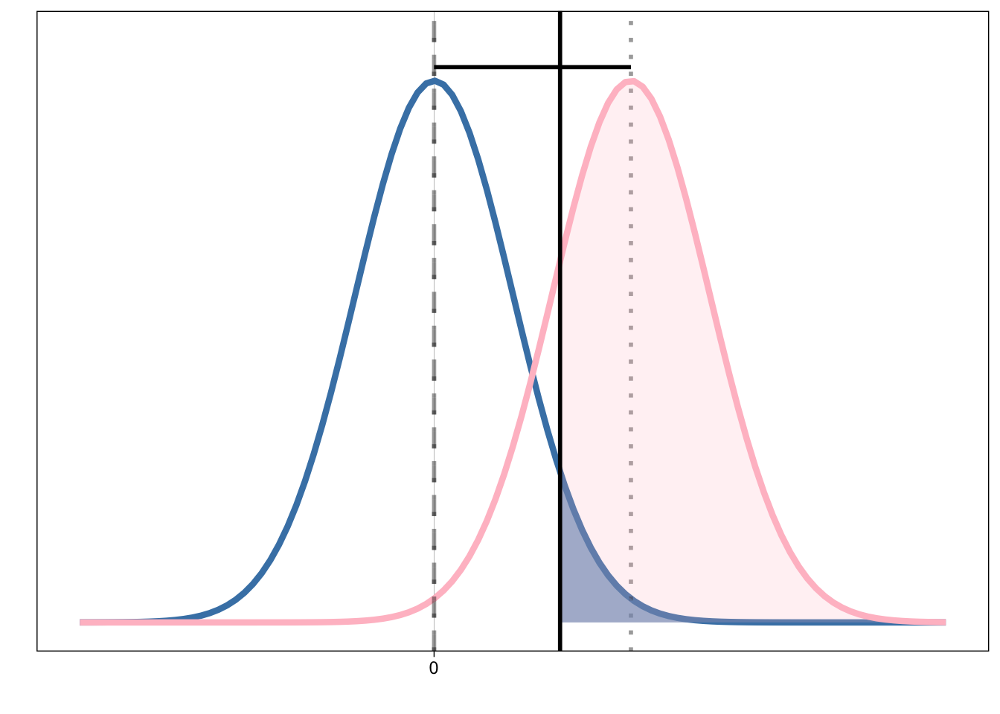

# Einführung Datenanalyse

In der Forschung und Diagnostik interessieren uns oft Eigenschaften eines Prozesses oder einer Person, welche wir nicht direkt messen können.
Testverfahren und Experimente werden angewendet, um diese latenten Variablen messbar zu machen. 
Mit statistischen Verfahren wird dann versucht aus den gemessenen Daten Informationen über die nicht direkt messbare Eigenschaft zu erhalten.

>Uns kann beispielsweise die Aufmerksamkeitsleistung interessieren, welche wir mit einem Testverfahren für Aufmerksamkeit zu messen versuchen. Eine Neurowissenschaftlerin, welche sich für den Prozess von Aufmerksamkeit interessiert, würde versuchen die Aufmerksamkeitsleistung von vielen Leuten unter verschiedenen Bedingungen zu messen um zu untersuchen, durch was Aufmerksamkeit beeinflusst wird.  Ein klinischer Neuropsychologe hingegen hätte vielleicht das Ziel festzustellen, ob die Aufmerksamkeitsleistung einer Person von der Norm abweicht, beispielsweise weil sie durch einen Unfall eine Kopfverletzung erlitten hat. Beide messen Daten und beide ziehen aus den gemessenen Daten Rückschlüsse auf eine unterliegende Eigenschaft eines Prozesses oder einer Person.

## Herausforderungen in der Analyse von neurowissenschaftlichen Daten

Neurowissenschaftliche Datensätze bringen oft folgende Herausforderungen in der Datenanalyse mit sich:

- Kleine Stichprobengrössen (z.B. aufgrund teurer Datenerhebung oder Patientengruppen die schwieriger zu rekrutieren sind).

- Heterogenität / Rauschen (z.B. weil der zu untersuchende Prozess schwierig zu isolieren ist, weil Personen sich sehr unterschiedlich verhalten)

- Teure Datenerhebung und damit hoher Druck Resultate zu generieren sowie oft keine Möglichkeit das Experiment zu wiederholen  (wichtig daher die gute Planung der Analyse sowie Vermeidung von inkonklusive Resultaten)

- Vorgehen bei nicht-signifikanten/nicht-konklusiven Ergebnissen (Research waste, publication bias/file drawer effect)

<aside>Im Artikel _Power failure: why small sample size undermines the reliability of neuroscience_ von Button et al. [2013](https://www.nature.com/articles/nrn3475) finden Sie einen Artikel über die Problematik von kleinen Stichprobengrössen in den Neurowissenschaften.</aside>

Ziel ist es, trotz diesen Umständen, __möglichst viel__ Information aus den vorhandenen Daten zu gewinnen.
Hierbei spielt die Analysemethode eine wichtige Rolle.

## *Absence of evidence* oder *Evidence of absence*?

Bei Nullhypothesen-Signifikanztests (NHST) wird eine binäre Entscheidung getroffen: Der Hypothesentest kann entweder ein signifikantes oder ein nicht signifikantes Ergebnis haben. 

Kann kein Effekt gefunden werden besteht die Notwendigkeit zu unterscheiden zwischen den zwei Möglichkeiten:
- _Absence of evidence_: Es ist unklar ob es einen Effekt gibt oder nicht. Die Ergebnisse des Verfahrens sind _inkonklusiv_.
- _Evidence of absence_: Es ist klar, dass es keinen Effekt gibt. Die Daten zeigen dies deutlich.

Zum Unterscheiden dieser zwei Fälle eignen sich die typischen NHSTs nicht gut, gerade wenn die Power nicht sehr hoch war.
Bayesianische Statistik (z.B. bei begrenzten Datensätzen) sowie frequentistische Äquivalenztests (zwei entgegengesetzte NHSTs zum Testen von Nullunterschieden) sind Ansätze, um zwischen _absence of evidence_ und _evidence of absence_ zu unterscheiden.

Wir werden uns in den folgenden Veranstaltungen deshalb damit auseinandersetzen,

- welche Annahmen hinter statistischen Verfahren stecken.

- welche Fragen mit Bayesianischer Statistik beantwortet werden können.

- wie Nullunterschiede statistisch getestet werden können.

:::callout-caution
## Hands-on: Reaktivierung Statistikwissen

__1. Besprechen Sie in kleinen Gruppen folgende Fragen:__

- Was ist eine _Null-_, was eine _Alternativhypothese_?

- Was bedeutet die Distanz zwischen den beiden Mittelwerten?

- Was ist statistische _Power_?

- Welche Rolle spielt die Stichprobengrösse?

- Was ist ein _p-Wert_?

- Was sind _Typ I_ und _Typ II_ Fehler?

- Welche Fragen können Sie mit einem _Nullhypothesen- Signifikanztest (NHST)_ beantworten?

***Können Sie die Begrifflichkeiten in dieser Grafik einordnen?***

{fig-align="center" width=50%}

__2. Planung der Analyse für unser Kursexperiment:__

- Überlegen Sie sich, was Null- und Alternativhypothese in unseren Kursexperiment sein könnte. Welches Analyseverfahren würden Sie wählen?

- Können mit dem gewählten Verfahren *evidence of absence* und *absence of evidence* unterschieden werden?

- Wenn nein: Wie würden Sie vorgehen? Würden Sie die Studie publizieren? Wie würden Sie dann das Paper gestalten? Welche Schwierigkeiten würden Sie eventuell antreffen? 

_[10-20 Minuten]_

:::

<aside>Sie können zur Beantwortung dieser Fragen z.B. die [Interaktive Visualisierung "Understanding Statistical Power and Significance Testing"](https://rpsychologist.com/d3/nhst/) nutzen.</aside>
