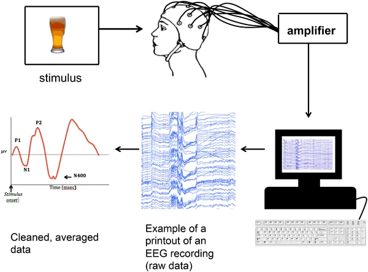
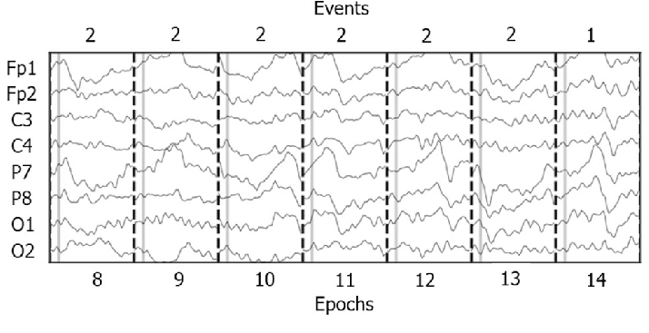

# Einführung EEG

## Was ist EEG?

Elektroenzephalographie (EEG) ist eine nicht-invasive Methode zur Messung elektrischer Aktivität im Gehirn. 
Dabei werden Elektroden auf der Kopfhaut angebracht, um Spannungsänderungen zu erfassen, die durch neuronale Aktivität entstehen.

### Was misst EEG?

EEG misst vor allem die **summierten postsynaptischen Potentiale** von grossen Gruppen von Nervenzellen, insbesondere den **pyramidalen Neuronen** im Kortex. 
Diese Neuronen liegen senkrecht zur Kopfhaut und erzeugen elektrische Felder, wenn sie aktiviert werden. 
Die gemessenen Signale stammen nicht von einzelnen Aktionspotentialen, sondern von der koordinierten Aktivität vieler Neuronen.

### Wichtige Eigenschaften des EEG

-   **Hohe zeitliche Auflösung** im Millisekundenbereich
-   **Nicht-invasiv** und relativ kostengünstig
-   Sensibel für Prozesse im Kortex, aber weniger für tieferliegende Strukturen
-   **Inverse Problem**: die Schwierigkeit, aus den EEG-Signalen auf der Kopfhaut eindeutig auf die zugrunde liegenden Quellen im Gehirn zu schliessen.

------------------------------------------------------------------------

## Grundlegende Schritte der EEG-Analyse (bis zu ERPs)

### Was sind ERPs?

{fig-align="center"}

_Source: Beres, A.M. Time is of the Essence: A Review of Electroencephalography (EEG) and Event-Related Brain Potentials (ERPs) in Language Research. Appl Psychophysiol Biofeedback 42, 247–255 (2017). https://doi.org/10.1007/s10484-017-9371-3_

Event-related potentials (ERPs) sind **zeitlich mit einem bestimmten Event verknüpfte Veränderungen im EEG-Signal**, die durch Mittelung über viele ähnliche Ereignisse gewonnen werden. 
Sie zeigen typische Wellenformen, die Rückschlüsse auf Wahrnehmung, Aufmerksamkeit oder Entscheidungsprozesse erlauben.

### ERP Analyse

Die Analyse von EEG-Daten erfolgt in mehreren Schritten, um aus dem Rohsignal Event-Related Potentials (ERPs) zu extrahieren. Hier ein Überblick über die wichtigsten Analysephasen:

#### 1. Datenimport

-   Laden der Rohdaten aus dem EEG-Aufzeichnungssystem
-   Enthält Informationen zu Kanälen, Sampling-Rate und Markern (Events)

#### 2. Vorverarbeitung (Preprocessing)

-   **Filterung**: Entfernen von Rauschen, z.B. tieffrequente Drift (High-Pass) oder Muskelartefakte (Low-Pass)
-   **Re-Referenzierung**: Wahl einer gemeinsamen Referenz (z.B. Durchschnitt aller Elektroden)
-   **Artefaktentfernung**: Ausschluss oder Korrektur von Störungen wie Augenbewegungen oder Blinzeln (z.B. mit Hilfe von ICA)

#### 3. Event-Markierung

-   Identifikation relevanter Zeitpunkte im EEG (z.B. Reizbeginn, Tastendruck)
-   Diese Marker definieren die Zeitfenster für weitere Analysen

{fig-align="center"}
_Source: Martínez Beltrán, E.T., Quiles Pérez, M., López Bernal, S. *et al.* Noise-based cyberattacks generating fake P300 waves in brain–computer interfaces. *Cluster Comput* **25**, 33–48 (2022). https://doi.org/10.1007/s10586-021-03326-z_

#### 4. Epochierung

-   Unterteilung des kontinuierlichen EEG in kurze Zeitabschnitte (Epochen) rund um das Event (z.B. -200 bis +800 ms)
-   Jede Epoche repräsentiert die Reaktion auf ein einzelnes Event

#### 5. ERP-Berechnung

-   Mitteln der Epochen über viele Trials pro Bedingung
-   Das resultierende ERP zeigt zeitlich stabile Hirnreaktionen auf spezifische Events

#### 6. Visualisierung und Interpretation

-   Darstellung der ERPs als Wellenformen (z.B. über die Zeit an bestimmten Elektroden)
-   Identifikation typischer Komponenten wie P1, N1, P300 usw.
-   Vergleich von Bedingungen oder Gruppen mit statistischen Tests
