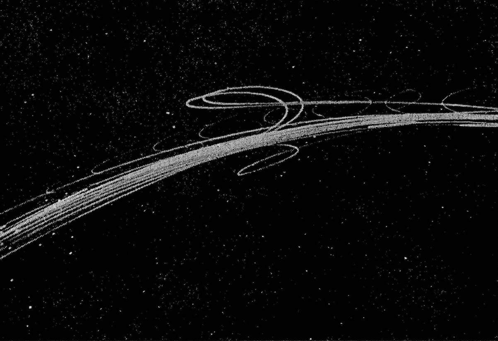
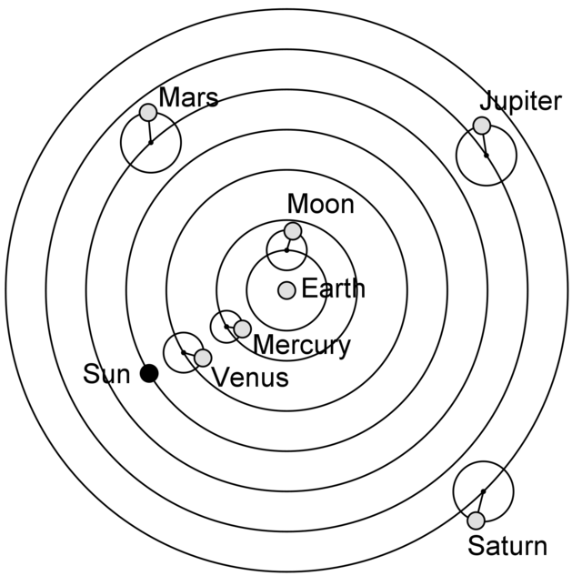
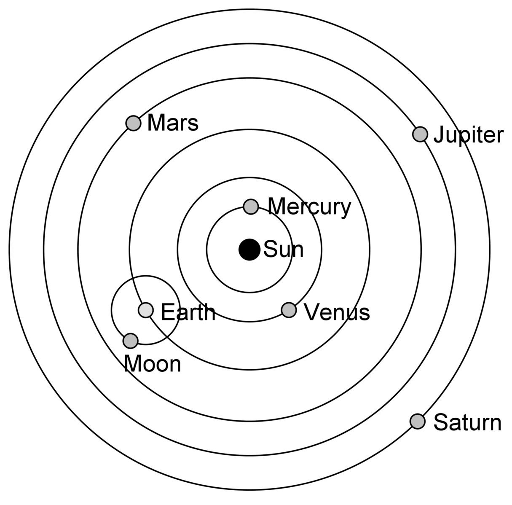
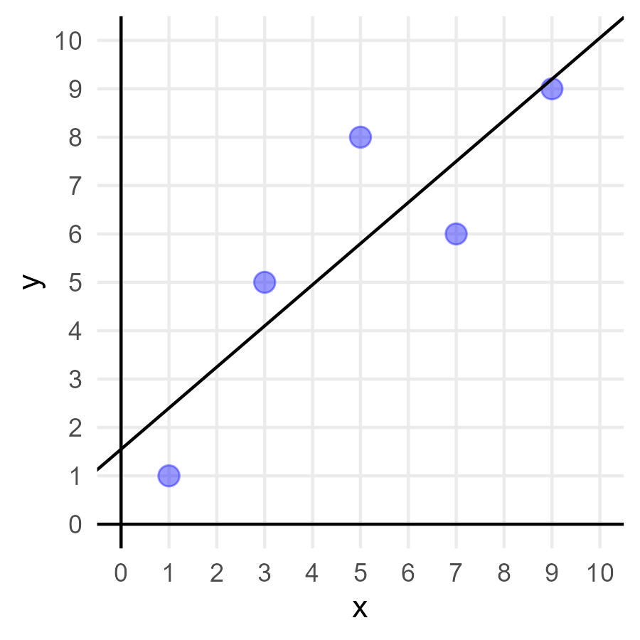

# Einführung in die Datenmodelierung

```{r}
#| echo: false
#| output: false 
library(tidyverse)
library(cowplot)
```


> Cognitive scientists seek to understand how the mind works. That is, we want to describe and predict people's behavior, and we ultimately wish to explain it, in the same way that physicists predict the motion of an apple that is dislodged from its tree (and can accurately describe its downward path) and explain its trajectory (by appealing to gravity). For example, if you forget someone's name when you are distracted seconds after being introduced to her, we would like to know what cognitive process is responsible for this failure. Was it lack of attention? Forgetting over time? Can we know ahead of time whether or not you will remember that person's name? [Lewandowsky & Farrell (2010, S. 1)](https://sk.sagepub.com/books/computational-modeling-in-cognition)

In der Neurowissenschaft möchten wir verstehen, was die neuronalen Grundlagen von Verhalten sind und wie Verhalten durch Prozesse im Gehirn erklärt werden können. 
Dafür erheben wir sehr komplexe Datensätze.

<br>

![Wir versuchen beispielsweise in fMRI-Studien aus der Stärke eines Signals in einem Voxel Informationen darüber zu gewinnen, wie Menschen Reize wahrnehmen oder Entscheidungen treffen. 
Häufig wird dafür das Signal in jedem Voxel mit dem erwarteten Signal wie die BOLD-response aussehen sollte verglichen^[<https://andysbrainbook.readthedocs.io/en/stable/fMRI_Short_Course/fMRI_05_1stLevelAnalysis.html>] und statistisch signifikante Voxel werden dann eingefärbt. Klaus & Wyssen et al. (2020): Obwohl diese eingefärbten Bereiche auf einer Abbildung simpel ersichtlich sind, sind für diesen einfachen Vergleich zwischen zwei Bedingungen mehrere Modellierungsschritte erforderlich.](../imgs/brainactivity.png){fig-align="center" width=100%}

Unser Ziel ist es als Neurowissenschaftler:innen von den Daten zu lernen, dafür versuchen wir sie zu beschreiben, vorherzusagen und zu erklären. 
Unabhängig davon, welche Art Daten wir erheben (behavioral, fMRI, EEG, etc.) interessieren wir uns dafür, wie diese Daten entstanden sind, genauer für den darunterliegenenden __datengenerierenden Prozess__.

Häufige Ansätze aus Daten Sinn zu extrahieren sind beispielsweise: 

- Daten deskriptiv beschreiben
- Vergleichen von Mittelwerten verschiedener Gruppen/Bedingungen
- Zusammenhänge von Variablen berechnen

Wir können aber weitaus mehr tun, um Daten zu verstehen.

## Warum braucht es Modelle?

Neurowissenschaftliche Daten werden selten nur durch einen Faktor beeinflusst.
Im Gegenteil: Meist sind sehr viele verschiedene Einflussfaktoren beteiligt, und sobald diese auch noch miteinander verknüpft sind, kommen wir Menschen kognitiv sehr schnell an unsere Grenzen.
Ab einer bestimmten Komplexität^[und diese ist extrem früh erreicht, wie das Beispiel _Game of life_ mit nur wenigen Regeln zeigt] können wir nicht mehr anhand simpler Deskriptivstatistik verstehen, welcher Prozess die Daten generiert hat.

Deshalb macht es Sinn sich Gedanken über den datengenerierenden Prozess zu machen und diesen zu modellieren.
Ein Modell ist eine auf das wesentliche reduzierte Erklärung für einen Prozess. Ein passendes Modell ermöglicht es uns Daten zusammenzufassen, Abläufe zu verstehen, zukünftige Daten vorherzusagen und idealerweise sogar die Erklärung eines Prozesses.
Wenn Sie den darunterliegenden datengenerierenden Prozess jedoch kennen, können Sie Daten erklären und auch zukünftige Zustände vorhersagen.

### Game of Life

Ein gutes Beispiel dafür ist das _Game of Life_. 
Das _Game of Life_ ist ein von Mathematiker John Horton Conway 1970 entworfenes Spiel bzw. Vorgehen. Hierbei besteht ein Raster mit inaktiven (weissen) sowie aktiven (schwarzen) Zellen. 
Die Zellinhalte entwickeln sich nach festgelegten, einfachen Regeln.

<aside> Ein anderes Beispiel dafür, dass wir intuitiv schnell falsch liegen, ist der _Collider Bias_^[<https://www.the100.ci/2017/03/14/that-one-weird-third-variable-problem-nobody-ever-mentions-conditioning-on-a-collider/>]
</aside>

<!-- <aside>  </aside> -->

<https://playgameoflife.com/>

::: {.callout-caution title="Hands-on: Whats going on in the game of life?"}


Schauen Sie sich die Entwicklung der Punkte an. Ihre Aufgabe ist es den Prozess, der den Daten zugrundeliegt, zu beschreiben und erklären:


1. Wie gehen Sie vor um den zugrundeliegenden Prozess zu untersuchen?

2. Wie können Sie Deskriptivstatistik und Inferenzstatistik anwenden, die Sie im Studium bisher gelernt haben?

3. Entdecken Sie wiederkehrende Muster?

4. Welche Regeln können Sie erkennen?

5. Können Sie, wenn Sie den Prozess anhalten, den nächsten Zustand vorhersagen?

:::

Wir könnten also versuchen oben genannte Vorgehensweisen anzuwenden, um den Prozess "hinter" dem _Game of Life_ zu verstehen:

Zuerst beobachten wir inaktive und aktive Zellen (Beobachtungsstudien) und in einem zweiten Schritt untersuchen wir die Zellen, indem wir systematisch in das Geschehen eingreifen (Experiment) in dem wir zum Start gewisse Zellen aktivieren oder deaktivieren.

Wir können versuchen aus den Daten Erkenntnisse zu gewinnen, in dem wir beispielsweise: 

- Daten deskriptiv beschreiben: _Schwarze Felder haben einen Anteil von 20%, weisse Felder einen Anteil von 80%._
- Vergleichen verschiedener Gruppen/Bedingungen: _Es gibt signifikant mehr weisse als schwarze Felder._
- Zusammenhänge von Variablen berechnen: _Je weiter unten ein Feld liegt, desto eher ist es schwarz."_

Weiter fällt uns vielleicht auf, dass wir häufig folgende Konstellationen beobachten können:


Daher könnten wir die wiederkehrenden Muster zählen und beispielsweise über die Zeit hinweg vergleichen: 

- Wie oft taucht ein bestimmtes Muster im Verlauf auf? 
- Folgen dieselben Muster immer aufeinander? 
- Können wir in verschiedenen Bedingungen diese verschiedenen Muster häufiger auftauchen lassen?

Wenn Sie all dies getan haben: 

- Wie gut können Sie den nächsten Zustand des Systems vorhersagen, wenn Sie einen bestehenden Zustand kennen?
- Verstehen Sie den Prozess? 
- Können Sie ihn erklären?

<!-- an der Tafel einen Zustand aufzeichnen -->

:::{.callout-tip title="Regeln des *Game of Life*" collapse="true"}

Die Regeln des _Game of Life_ lauten:

- Eine aktive Zelle bleibt auch in der Folgegeneration aktiv (lebt weiter), wenn sie entweder zwei oder drei aktive Nachbarn hat. 
- Eine inaktive Zelle wird aktiv („wird geboren“/lebt in der Folgegeneration), wenn sie genau drei aktive Nachbarn hat.

Daraus folgt:

- Eine aktive Zelle mit keiner, einer oder mehr als drei aktiven Zellen um sich her wird inaktiv ("stirbt"). 
- Eine inaktive Zelle bleibt inaktiv, solange sie keine, eine, zwei oder mehr als drei aktive Zellen um sich her hat.

Hätten Sie aus diesen Regeln das Muster vorhersagen können ohne Zellen zu zählen und es aufzuzeichnen?
:::

## Wie wird ein Prozess modelliert?

> There is little doubt that even before you started reading this book, you had already fit many models to data. No one who has completed an introductory statistics course can escape learning about linear regression. It turns out that every time you computed a regression line, you were actually fitting a model—namely, the regression line with its two parameters, slope and intercept—to the data. Lewandowsky & Farrell [(2010, S. 71)](https://sk.sagepub.com/books/computational-modeling-in-cognition)

### Planetare Bewegung

Ein Beispiel dafür, wie ein datengenerierender Prozess über Jahrhunderte hinweg modelliert wurde, ist die planetare Bewegung:
Menschen haben über sehr lange Zeit hinweg durch das Beobachten der Objekte im Himmel versucht zu verstehen, wie diese Bewegungen zustande kommen.
Das folgende Beispiel basiert auf dem Buch von Lewandowsky & Farrell [(2011)](https://sk.sagepub.com/books/computational-modeling-in-cognition). 

Die Daten die beobachtet wurden, waren die beobachtbaren Objekte im Himmel über die Zeit.
Dies führte zu zwei Erkenntnissen:

- einige Planeten ändern plötzlich ihre Richtung
- nach einiger Zeit nehmen sie ihren ursprünglichen Weg wieder auf

{fig-align="center" width=50%}


:::: {layout="[ 50, 50 ]"}

::: {#first-column}

{fig-align="center" width=50%}

:::

::: {#second-column}

{fig-align="center" width=50%}

:::
::::

Es zeigt sich also: 

- Die Daten lassen sich nur mit einem Modell des zugrunde liegenden  Prozesses erklären.
- Modelle an sich können nicht beobachtet werden.
- Es gibt fast immer mehrere Modelle, welche die Daten erklären können

:::{.callout-caution title="Hands-on: Modelle und Realität"}

Was haben untenstehende Zitate und die Abbildung gemeinsam?

> __All models are wrong, some are useful.__ George Box (1976)

> __The map is not the territory.__ Gregory Bateson (1988)

{fig-align="center" width=40%}
:::


## Summary

> "We suggest that purely verbal theorizing in cognition is increasingly inadequate in light of the growing richness of our data: whereas several decades ago decision-making tasks might have yielded only simple accuracy measures, we now have access not only to accuracy but also to the latencies of all response classes and their distributions. This richness defies verbal analysis but presents an ideal landscape for computational modeling. 
Indeed, we suggest that models also help avoid replication failures because the likelihood that an experiment will yield a quantitatively predicted intricate pattern of results involving multiple dependent variables by chance alone is surely lower than that a study might, by randomness alone, yield simple pairwise differences between conditions that happen to mesh with a verbally specified theoretical notion. 
Second, we consider the increasingly tight connection between modeling and the cognitive neurosciences to be a particularly promising arena. Measurement models, explanatory models, and cognitive architectures are now either directly neurally inspired, or they provide a conceptual bridge between behavioral data and their neural underpinnings. There is little doubt that this trend will continue in the future." Lewandowsky & Oberauer [(2018)](https://onlinelibrary.wiley.com/doi/abs/10.1002/9781119170174.epcn501)

## Weiterführende Literatur

- Forstmann, B. U., & Wagenmakers, E. J. (2015). Model-based cognitive neuroscience: A conceptual introduction. In An introduction to model-based cognitive neuroscience (pp. 139-156). New York, NY: Springer New York.

- Lewandowsky, S., & Farrell, S. (2010). Computational modeling in cognition: Principles and practice. Sage.

- Lewandowsky, S., & Oberauer, K. (2018). Computational modeling in cognition and cognitive neuroscience. Stevens' handbook of experimental psychology and cognitive neuroscience, 5, 1-35.

- Lektüre für die Semesterferien: "Models of the Mind: How Physics, Engineering, and Mathematics Have Shaped Our Understanding of the Brain" von Grace Lindsay (2021)

<!-- ## Modellieren eines datengenerierenden Prozesses -->

<!-- Durch das Erstellen eines Modells können sowohl Daten analysiert werden, wie auch neue Daten generiert werden (siehe auch [Kapitel 13](intro_analysis.qmd)). -->

<!-- Im Beispiel oben wurde versucht anhand der Daten heraus zu finden, wann Zellen aktiv/inaktiv werden bzw. wie das Universum aufgebaut ist.  -->
<!-- Es wurde ein Modell verwendet, um Informationen aus den Daten zu gewinnen.  -->
<!-- Wechseln wir nun zu einem etwas einfacheren Beispiel.  -->
<!-- Stellen Sie sich vor wir werfen einen Stein.  -->
<!-- Die Endposition des Steins hängt von den Kräften ab, die auf den Stein wirken. -->

<!--  -->

<!-- ### Verbales Modell -->

<!-- Beginnen wir mit einem verbalen Modell von diesem Prozess.  -->
<!-- Die Endposition des Steins hängt von der Kraft und der Richtung (Input) des Wurfs ab.  -->
<!-- Faktoren wie z.B. der Luftwiderstand oder die Gravitationskraft berücksichtigen wir vorerst nicht in unserem Modell, da sie konstant sind. -->
