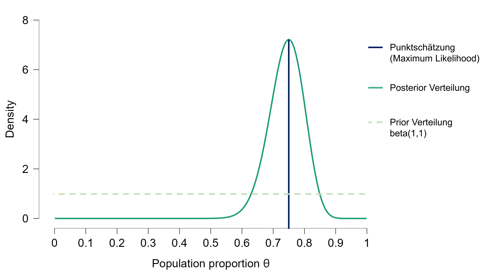
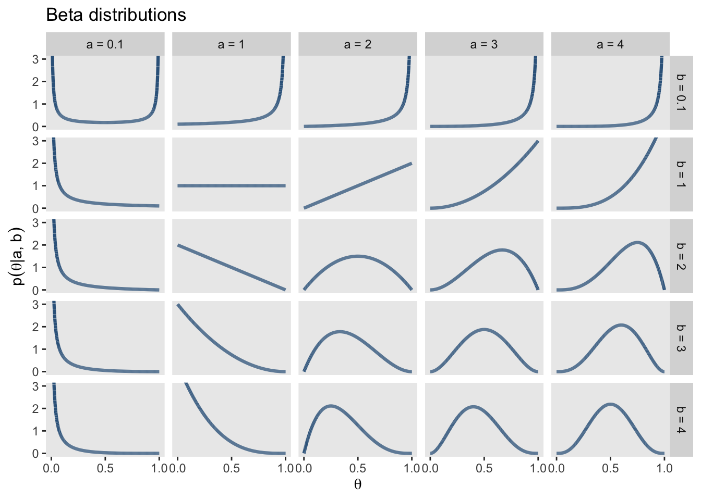
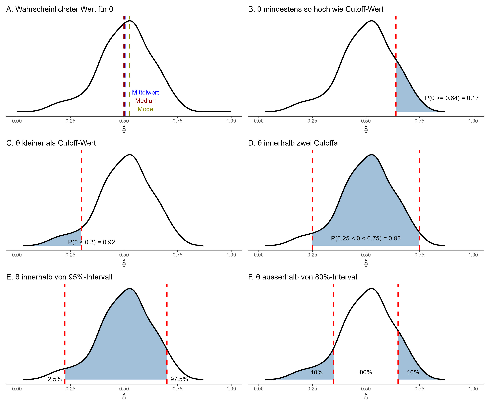

# Parameterschätzung: Einführung in die Bayesianische Statistik

Nach dem Data Cleaning und Preprocessing geht es darum, welche Informationen die Daten über den zu untersuchenden Prozess beinhalten.
Anhand der Daten sollen also Rückschlüsse auf den Prozess der zu diesen Daten geführt hat geschlossen werden. 
Dies wird mit folgenden Schritten gemacht

1. __Parameterschätzung__: Bei der Parameterschätzung wird ein Wert des datengenerierenden Prozesses geschätzt. Sie erlaubt das Quantifizieren eines Parameters, also eines Werts, der wahrscheinlich den Daten zugrundeliegt. Beispiel: Die Schätzung eines Mittelwerts (Parameter) einer Normalverteilung.

2. __Hypothesentests__: Hypothesentests vergleichen zwei statistische Modelle. Sie erlauben eine Entscheidung, z.B. ob ein signifikanter Unterschied vorhanden ist oder nicht? Um diese Entscheidung zu treffen muss eine "Fehlerwahrscheinlichkeit" bestimmt werden. (Wie sicher will ich sein?)

## Frequentistische und Bayesianische Parameterschätzung

In der Frequentistischen Statistik wird angenommen, dass ein Parameter einen wahren (aber unbekannten) Wert hat. 
Die frequentistische Parameterschätzung ergibt eine Punktschätzung: Der geschätzte Parameter hat damit genau __einen__ Wert und keine Wahrscheinlichkeitsverteilung. 
Daher dürfen keine Aussagen über eine Wahrscheinlichkeitsverteilung des Parameters bzw. die Wahrscheinlichkeit eines Parameterswerts gemacht werden. Nur Ereignisse die wiederholt werden können eine Wahrscheinlichkeit (eine Häufigkeitsverteilung) haben.

In der Bayesianischen Statistik hingegen wird für jeden möglichen Parameterwert geschätzt, wie wahrscheinlich dieser einzelne Wert ist in Anbetracht der Vorannahmen (Priors) und der Daten. 
Das bedeutet, wir erhalten für jeden dieser Werte gleichzeitig auch eine Wahrscheinlichkeit mit der dieser zutrifft.
Die Zusammenfassung aller geschätzten Werte und deren Wahrscheinlichkeiten wird in der _Posterior-Verteilung_ zusammengefasst. 
Die Posterior Wahrscheinlichkeit beschreibt unser _degree of belief_, also unser aktuelles Wissen darüber, wie wahrscheinlich dieser Parameterwert wirklich hinter den Daten steckt. 

:::callout-caution

## Hands-on: Frequentistisch oder Bayesianisch?

Ordnen Sie die untenstehenden Aussagen dem frequentistischen bzw. dem baysianischen Ansatz zu:

- "Der Mittelwert liegt mit 95%-iger Wahrscheinlichkeit zwischen 0.75 und 0.85 Sekunden."

- "Wenn das Experiment 100 Mal wiederholt wird, ist der wahre Mittelwert in 95% der Konfidenzintervalle enthalten."

:::

Wir schauen uns die unterschiedlichen Ansätze der Parameterschätzung im Folgenden an einem Beispiel an. Wir haben bei einer Person z.B. beobachtet, dass sie in 15 von 20 Trials korrekt geantwortet hat.

```{r}
correct <- 15 # Anzahl korrekter Antworten
trials <- 20 # Anzahl Trials insgesamt
```

### Maximum-Likelihood Schätzung

$\theta$ ist der Parameterwert unter dem die beobachteten Daten am wahrscheinlichsten entstanden sind. Die beste Punktschätzung des Parameters $\theta$, die wir machen können, wenn wir nur die Daten betrachten, und kein weiteres Vorwissen berücksichtigen, ist die Maximum-Likelihood Schätzung. 

Möchten wir also z.B. schätzen mit welcher Wahrscheinlichkeit die Person beim nächsten Trial eine richtige Antwort gibt, können wir dies aus den bisherigen Trials berechnen:

$$\theta = correct / all $$ 

Wenn die Person in insgesamt 20 Trials 15 Mal richtig geantwortet hat, wäre die Schätzung

$\theta = 15 / 20 = 0.75$

```{r}
theta <- correct / trials
theta
```
Wir erhalten eine Punktschätzung (__einen__ Wert), die uns angibt mit welcher Wahrscheinlichkeit die Person beim nächsten Trial richtig antworten wird, nämlich 0.75 bzw. sie wird in 3/4 der Fälle richtig antworten.

Wenn man ganz viele Male diese Spiele wiederholen würde, dann würde man diese Messung am wahrscheinlichsten reproduzieren können, wenn man für $\theta$ den Wert `r theta` einsetzt. 

Der grosse Nachteil einer Punktschätzung ist es, dass wir keine  Wahrscheinlichkeitsverteilung erhalten. 
Es gäbe auch noch viele andere Parameterwerte, die dieses Ergebnis von 15 korrekten Antworten in 20 Trials hervorbringen könnten, z.B. $\theta = 0.73$ oder $\theta = 0.78$.
Diese werden bei der Punktschätzung nicht beachtet. 

Um das zu veranschaulichen plotten wir die Wahrscheinlichkeit von 15 korrekten Antworten in 20 Trials für alle Werte welche $\theta$ annehmen könnte. Diese Werte liegen zwischen 0 und 1, da wir von einer Wahrscheinlichkeit sprechen.

```{r message = FALSE, warning = FALSE}
library(tidyverse)

# Daten generieren
d <- tibble(x = seq(from = 0, to = 1, by = .01)) |>
    mutate(density = dbinom(15, 20, x))

d |>
    ggplot(aes(x = x, ymin = 0, ymax = density)) +
    geom_ribbon(alpha = 0.5, fill = "steelblue") +
    geom_vline(xintercept = theta, linetype = 2, linewidth = 1.2) +
    scale_y_continuous(NULL, breaks = NULL) +
    coord_cartesian(xlim = c(0, 1)) +
    labs(x = expression(paste("Geschätzter Wert von ", theta))) +
    theme_minimal()
```
Die Punktschätzung von $\theta$ wird mit der schwarzen gestrichelten Linie dargestellt. Die hellblaue Fläche zeigt, wie wahrscheinlich die einzelnen Werte jeweils sind (hier abgebildet sehen Sie _relative_ Wahrscheinlichkeiten).

:::callout-caution

## Hands-on: Punktschätzung 

Diskutieren Sie in kleinen Gruppen, wie sinnvoll es ist sich hier auf einen Wert festzulegen:

- Wie genau denken Sie bildet die Punktschätzung die Realität ab?

- Wie viel wahrscheinlicher ist das berechnete $\theta = 0.75$ im Vergleich zu $\theta = 0.70$?

- Was kann das Schätzen der Wahrscheinlichkeit für alle Parameterwerte für einen Mehrwert bringen?

- Wo kann eine Punktschätzung einen Mehrwert haben?
:::

### Posterior-Schätzung in der Bayesianischen Statistik

In der Bayesianischen Statistik wird die Wahrscheinkeitslehre angewandt, um die Wahrscheinlichkeit von Parameterwerten zu berechnen.
Es wird für jeden möglichen Parameterwert die Wahrscheinlichkeit geschätzt mit der dieser Parameterwert die Daten generiert hat. 
Im Gegensatz zu der Frequentistischen Statistik wird hier also nicht eine Punktschätzung vorgenommen (ein "wahrer Wert" geschätzt), sondern es wird ein Verteilung geschätzt.

:::callout-info
Die Posterior-Verteilung beschreibt, wie wahrscheinlich verschiedene Werte eines unbekannten Parameters sind – basierend auf Vorwissen (Prior) und den beobachteten Daten. 
:::

Dass der Posterior über _alle_ möglichen Parameterwerte integriert wird, ist eine grösse Stärke der Bayesianischen Statistik. 
So wird der ganze Möglichkeitsraum beschrieben. 
Es wird nicht nur der wahrscheinlichste Parameterwert berücksichtigt wie bei der Punktschätzung, sondern durch das Einbeziehen der ganzen Parameterverteilung können auch Nebenoptima und "fast" genauso wahrscheinliche Werte einbezogen werden.

Um die Posterior-Verteilung, also die Wahrscheinlichkeit aller Parameterwerte, zu berechnen wird in der Bayesianischen Statistik das Bayes Theorem verwendet. 

::: {.callout-note appearance="simple"}

### Bayes Theorem

Das Bayes Theorem gibt die Formel für eine bedingte Wahrscheinlichkeit $P(A|B)$ an. 

$$ P(A|B) = \frac{P(B|A)⋅P(A)}{P(B)} $$

Das kann gelesen werden als: "Die Wahrscheinlichkeit eines Ereignisses $A$ unter der Bedingung, dass ein Ereignis $B$ wahr ist, ist gleich der a priori Wahrscheinlichkeit, dass $A$ wahr ist, multipliziert mit der Wahrscheinlichkeit, dass $B$ eintritt, wenn $A$ wahr ist. 
Dividiert wird das Ganze durch die Wahrscheinlichkeit, dass $B$ eintritt, egal ob $A$ wahr oder falsch ist."
:::

Das bedeutet, um eine Bayesianische Parameterschätzung zu machen, müssen wir Vorwissen integrieren. Dies tun wir in Form einer Prior-Verteilung. 
Ein simple Variante ist, den Prior ist so zu wählen, dass er allen möglichen Werten dieselbe Wahrscheinlichkeit zuschreibt (wie in der Grafik unten). Diese Verteilung wird _uniform_ genannt. Ein uniformer Prior ist aber selten empfehlenswert, da er zu breit und uniformativ ist.

__Parameterschätzung__



:::callout-caution

## Hands-on: Bayesianische Parameterschätzung in JASP

Aktivieren Sie in JASP das Modul _Learn Bayes_. Wählen Sie unter `Learn Bayes` > `Binomial Estimation` mit der Einstellung `Enter Sequence`.

Eine Person behauptet sie besitze extrasensorische Fähigkeiten. 
Sie sagt, dass vorhersagen kann, auf welcher Seite eine aufgeworfene Münze landet: Kopf oder Zahl.

Sie als Forschungsgruppe möchten dies untersuchen. Sie lassen die Person in Ihr Labor kommen und lassen sie Vorhersagen machen.
Sie lassen sie z.B. die Münze 20 mal werfen und die Person macht 15 korrekte Vorhersagen.
Wie würden Sie die Behauptung der Person überprüfen?

- Wählen Sie in JASP unter `LearnBayes` > `Binomial Estimation`

__1. Modell.__ 

- **Daten**: Welche 2 Variablen werden erhoben? Welche Werte können die annehmen?

- **DAG**: Welchen Parameter schätzen SieE? Wie werden die Daten verteilt sein? Wie sieht das DAG aus?

- **Prior**: Glauben Sie, dass die Person über extrasensorische Fähigkeiten verfügt? Sind Sie skeptisch? Wie können Sie Ihre Vorannahme formalisieren (siehe Abbildung unten)? Passen Sie Ihren Prior für $\theta$ in JASP an.

__2. Entscheidungskriterium__

- Was würde Sie überzeugen, dass die Person extrasensorische Fähigkeiten hat? 

- Was würde Sie überzeugen, dass die Person keine extrasensorische Fähigkeiten hat? (In welchem Bereich müsste $\theta$ liegen?)

- Wo wären Sie unsicher?

__2. Daten erheben.__ 

- Wählen Sie in JASP unter `enter sequence` und geben Sie für korrekte Antworten `1` und für falsche `0` ein. 

- Unter den Dropdown Menus `Model, Prior and Posterior Distributions` und `Plots` gibt es verschiedene Checkboxes. Versuchen Sie herauszufinden, was diese bewirken.

__Beta Verteilungen__


:::

## Zusammenfassen von Posteriors

Der Vorteil einer Posterior-Verteilung im Vergleich zu einer Punktschätzung ist es, dass damit Aussagen zu der Wahrscheinlichkeit eines Parameterwertes gemacht werden können.
Posterior-Verteilungen werden mit Hilfe von Kennzahlen zusammengefasst. 

Typische Zusammenfassungen sind Mittelwert, Median, Modus und Intervalle (Credible Intervals).
Hier einige Beispiele, zu möglichen Aussagen:

- _A._ $\theta$ liegt am wahrscheinlichsten bei $X$. (Mittelwert, Median, Modus)

- _B._ Die Wahrscheinlichkeit, dass $\theta$ mindestens $X$ ist, liegt bei $P_x$.

- _C._ Die Wahrscheinlichkeit, dass $\theta$ kleiner als $X$ ist, liegt bei $P_x$.

- _D._ Die Wahrscheinlichkeit, dass $\theta$ zwischen $X_{tiefer}$ und $X_{höher}$ liegt ist $P_x$.

- _E._ $\theta$ liegt mit einer Wahrscheinlichkeit von 95% zwischen $X_{tiefer}$ und $X_{höher}$. 

- _F._ $\theta$ liegt mit einer Wahrscheinlichkeit von 20% ausserhalb des Bereichs zwischen $X_{tiefer}$ und $X_{höher}$.



```{r}
#| include: false
#| eval: false

library(patchwork)
library(dplyr)

# Simulate distribution of theta values
set.seed(42)
n = 20
successes <- rbinom(100, n, prob = 0.5)
theta_hat <- successes / n

d <- tibble(theta_hat)
dens <- density(theta_hat)
theta_mode <- dens$x[which.max(dens$y)]
density_xy <- tibble(x = dens$x, y = dens$y)

# Plot A: wahrscheinlichster Wert
p1 <- ggplot(d, aes(x = theta_hat)) +
    geom_density(fill = "white", color = "black", size = 1) +
    geom_vline(aes(xintercept = mean(theta_hat)), color = "blue", linetype = "dashed", size = 1) +
    geom_vline(aes(xintercept = median(theta_hat)), color = "darkred", linetype = "dashed", size = 1) +
    geom_vline(aes(xintercept = dens$x[which.max(dens$y)]), color = "yellow4", linetype = "dashed", size = 1) +
    annotate("text", x = 0.6, y = 0.7, label = "Mittelwert", color = "blue") +
    annotate("text", x = 0.6, y = 0.4, label = "Median", color = "darkred") +
    annotate("text", x = 0.6, y = 0.1, label = "Mode", color = "yellow4") +
    xlim(0, 1) +
    scale_y_continuous(NULL, breaks = NULL) +
    labs(title = "A. Wahrscheinlichster Wert für θ",
         x = expression(hat(theta))) +
    theme_classic()

# Plot B: Theta mindestens Cutoff
cutoff_b <- 0.64
shade_b <- density_xy |> filter(x >= cutoff_b)
prob_b <- mean(theta_hat > cutoff_b)

p2 <- ggplot() +
    geom_area(data = shade_b, aes(x = x, y = y), fill = "steelblue", alpha = 0.5) +
    geom_line(data = density_xy, aes(x = x, y = y), color = "black", size = 1) +
    geom_vline(xintercept = cutoff_b, color = "red", linetype = "dashed", size = 1) +
    annotate("text", x = cutoff_b+0.11, y = 0.5, 
             label = paste0("P(θ >= ", cutoff_b, ") = ", round(prob_b, 2)), hjust = -0.1) +
    xlim(0, 1) +
    scale_y_continuous(NULL, breaks = NULL) +
    labs(title = "B. θ mindestens so hoch wie Cutoff-Wert", 
         x = expression(hat(theta))) +
    theme_classic()

# Plot C: Theta unter Cutoff
cutoff_c <- 0.3
shade_c <- density_xy |> filter(x < cutoff_c)
prob_c <- mean(theta_hat > cutoff_c)

p3 <- ggplot() +
    geom_area(data = shade_c, aes(x = x, y = y), fill = "steelblue", alpha = 0.5) +
    geom_line(data = density_xy, aes(x = x, y = y), color = "black", size = 1) +
    geom_vline(xintercept = cutoff_c, color = "red", linetype = "dashed", size = 1) +
    annotate("text", x = 0.48, y = 0.13, 
             label = paste0("P(θ < ", cutoff_c, ") = ", round(prob_c, 2)), 
             hjust = 1.1) +
    xlim(0, 1) +
    scale_y_continuous(NULL, breaks = NULL) +
    labs(title = "C. θ kleiner als Cutoff-Wert",
         x = expression(hat(theta))) +
    theme_classic()

# Plot D: Wahrscheinlichkeit von theta zwischen zwei Werten
lower <- 0.25
upper <- 0.75
prob_d <- mean(theta_hat > lower & theta_hat < upper)
shade_d <- density_xy |> filter(x >= lower & x <= upper)

p4 <- ggplot() +
    geom_area(data = shade_d, aes(x = x, y = y), fill = "steelblue", alpha = 0.5) +
    geom_line(data = density_xy, aes(x = x, y = y), color = "black", size = 1) +
    geom_vline(xintercept = c(lower, upper), color = "red", linetype = "dashed", size = 1) +
    annotate("text", x = 0.5, y = 0.03, 
             label = paste0("P(", round(lower, 2), " < θ < ", round(upper, 2), ") = ", round(prob_d, 2)),
             vjust = -1) +
    xlim(0, 1) +
    scale_y_continuous(NULL, breaks = NULL) +
    labs(title = "D. θ innerhalb zwei Cutoffs", 
         x = expression(hat(theta))) +
    theme_classic()


# Plot E: 95% credible interval
ci_95 <- quantile(theta_hat, probs = c(0.025, 0.975))
shade_e <- density_xy |> filter(x >= ci_95[1] & x <= ci_95[2])

p5 <- ggplot() +
    geom_area(data = shade_e, aes(x = x, y = y), fill = "steelblue", alpha = 0.5) +
    geom_line(data = density_xy, aes(x = x, y = y), color = "black", size = 1) +
    geom_vline(xintercept = ci_95, color = "red", linetype = "dashed", size = 1) +
    annotate("text", x = ci_95[1], y = 0.02, label = "2.5%", hjust = 1.2) +
    annotate("text", x = ci_95[2], y = 0.02, label = "97.5%", hjust = -0.2) +
    xlim(0, 1) +
    scale_y_continuous(NULL, breaks = NULL) +
    labs(title = "E. θ innerhalb von 95%-Intervall", 
         x = expression(hat(theta))) +
    theme_classic()

# Plot F: Untere und obere 10%
ci_10 <- quantile(theta_hat, probs = c(0.1, 0.9))
shade_f1 <- density_xy %>% filter(x < ci_10[1])
shade_f2 <- density_xy %>% filter(x > ci_10[2])

p6 <- ggplot() +
    geom_area(data = shade_f1, aes(x = x, y = y), fill = "steelblue", alpha = 0.5) +
    geom_area(data = shade_f2, aes(x = x, y = y), fill = "steelblue", alpha = 0.5) +
    geom_line(data = density_xy, aes(x = x, y = y), color = "black", size = 1) +
    geom_vline(xintercept = ci_10, color = "red", linetype = "dashed", size = 1) +
    annotate("text", x = mean(ci_10), y = 0.03, label = "80%", vjust = -1) +
    xlim(0, 1) +
    annotate("text", x = 0.27, y = 0.03, label = "10%", vjust = -1) +
    xlim(0, 1) +
    annotate("text", x = 0.72, y = 0.03, label = "10%", vjust = -1) +
    xlim(0, 1) +
    scale_y_continuous(NULL, breaks = NULL) +
    labs(title = "F. θ ausserhalb von 80%-Intervall", 
         x = expression(hat(theta))) +
    theme_classic()

# 2x3 grid
(p1 | p2 ) / (p3 | p4) / (p5 | p6)
#ggsave(dpi = 300, filename = "imgs/posteriorsummary.jpg", width = 12, height = 10)

```

<aside> Gute Möglichkeiten zum Zusammenfassen von Posterior-Verteilungen bieten die Plot-Funktionen _R-Packages_ [{brms}](https://paulbuerkner.com/brms/), [{tidybayes}](https://mjskay.github.io/tidybayes/) und [{bayesplot}](https://mc-stan.org/bayesplot/). </aside>

:::callout-caution
## Hands-on: Credible interval vs. confidence interval
__Credible interval__ ist ein bayesianisches Konzept, das sich vom __confidence interval__ (Konfidenzintervall) in der frequentistischen Statistik unterscheidet. Ein __credible interval__ ist ein Intervall, das eine bestimmte Wahrscheinlichkeit enthält, dass der wahre Parameter innerhalb dieses Intervalls liegt. Dies sollte nicht mit dem Konfidenzintervall verwechselt werden. Können Sie sich daran erinnern, wie ein Konfidenzintervall definiert ist? Was ist der Unterschied zwischen einem Konfidenzintervall und einem credible interval?

Diese Visualisierungen sind hilfreich im Verstehen der Unterschiede:

- [Confindence Intervals](https://rpsychologist.com/d3/ci/)

- [Credible Intervals](https://rpsychologist.com/d3/bayes/)

:::

## Entscheidung

Anhand der Posterior-Verteilung eines Parameters kann eine Entscheidung getroffen werden.
Wichtig ist hierbei, dass diese Kriterien vor dem Betrachten der Posterior-Verteilungen festgesetzt werden (analog zu den Hypothesen und Signifikanzniveaus bei frequentistischen Verfahren).
Beispiele für Entscheidungskriterien sind:

- _Wenn 95% der geschätzen Parameterwerte über einem bestimmten Cut-off liegen, ist der Unterschied bedeutsam._

- _Ist der geschätzte Parameterwert mehr als 2 Einheiten von 0 verschieden, so wird auf einen Unterschied geschlossen._

aber auch:

- _Unterscheiden sich die Posterior-Verteilungen zweier Parameterschätzungen nicht zu mehr als 10% wird darauf geschlossen, dass kein Unterschied besteht._

- _Sind 95% der wahrscheinlichsten Parameterwerte näher als 2 Einheiten von 0, gibt es keinen Unterschied._

Hier zeigt sich der Vorteil der Bayesianischen Parameterschätzung: Wir können durch das Zusammenfassen der Posterior-Verteilung direkt _evidence of absence_ testen.

Das Entscheidungskriterium kann flexibel an die Fragestellung angepasst werden. 
Deshalb ist eine vorherige Festlegung essentiell!
Unabhängig davon, ob eine frequentistische oder bayesianische Analyse verwendet wird, werden Entscheidungskriterien, idealerweise vor der Datenanalyse in einer Präregistration festgehalten! 


:::callout-caution
## Hands-on: Entscheidungen aufgrund von Posterior-Verteilungen

Wie könnten Entscheidungen aussehen bezüglich unserer Kursexperiment-Daten?

Erstellen Sie je ein Entscheidungskriterium, für das Erkennen eines Effekts und für die Abwesenheit eines Effekts.

:::


### Wrap-up

Zusammenfassend kann gesagt werden:

- In der _frequentistischen Statistik_ wird angenommen, dass der Parameter einen _wahren Wert_ hat, den wir aber nicht kennen. Wir erhalten als Resultat eine Punktschätzung für den Parameter und können keine Aussage über die Wahrscheinlichkeit dieses einen geschätzten Parameterwerts machen. Der 95%-CI (__confidence interval__) sagt aus, dass bei Wiederholung des Experiments der "wahre" Parameterwert in 95% der Konfidenzintervalle enthalten sein wird. 

- In der _bayesianischen Statistik_ wird angenommen, dass der Parameter eine Wahrscheinlichkeitsverteilung hat, die wir schätzen können. Es muss zusätzlich eine Priorverteilung festgelegt werden. Wir erhalten eine Posterior Verteilung für die Parameterwerte und können eine Aussage über Wahrscheinlichkeit eines Parameterwerts oder eines Modelles machen. Der 95%-CrI (__credible interval__) enthält zu 95% den "wahren" Parameterwert.

<aside>"Wahr" bedeutet hier, den Parameterwert der (angenommen ein passendes Modell wurde verwendet) zu diesen Daten geführt hat.</aside>

:::callout-note
# Take Home
In der Bayesianischen Statistik erhalten wir nach der Anwendung des Satzes von Bayes die sogenannte Posterior-Verteilung. Sie beschreibt, wie wahrscheinlich verschiedene Werte eines unbekannten Parameters sind – basierend auf unserem Vorwissen (Prior) und den beobachteten Daten. 
:::

### Weiterführende Informationen

- Kruschke, J.K., Liddell, T.M. The Bayesian New Statistics: Hypothesis testing, estimation, meta-analysis, and power analysis from a Bayesian perspective. Psychonomic Bulletin & Review 25, 178–206 (2018). <https://doi.org/10.3758/s13423-016-1221-4>

- McElreath, R. (2020). Statistical Rethinking. A Bayesian Course with examples in R and Stan. <https://xcelab.net/rm/> & <https://youtu.be/ztbYkBPDOgU?si=H14iHuMdez5HKyn->

