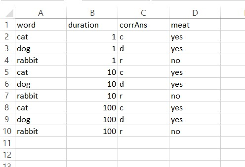
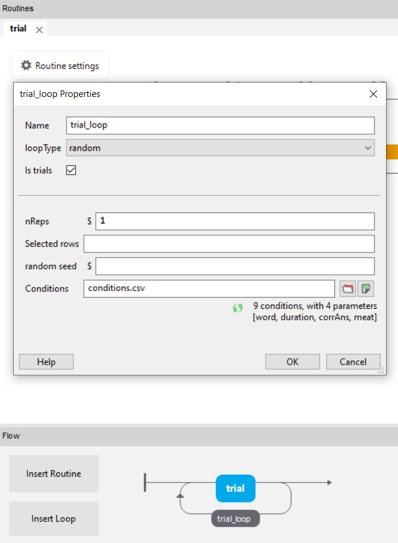
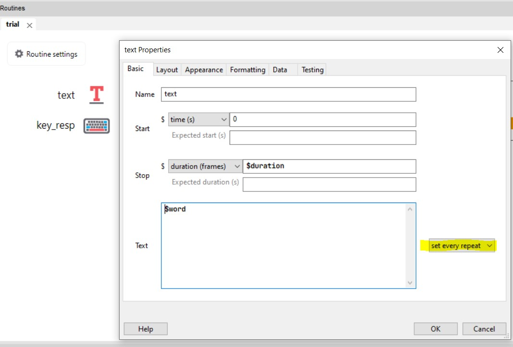
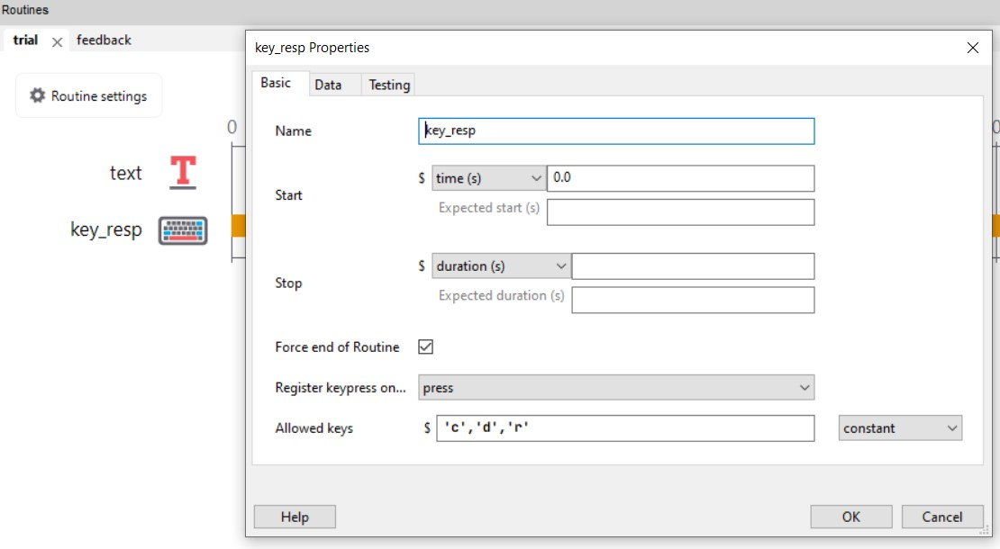
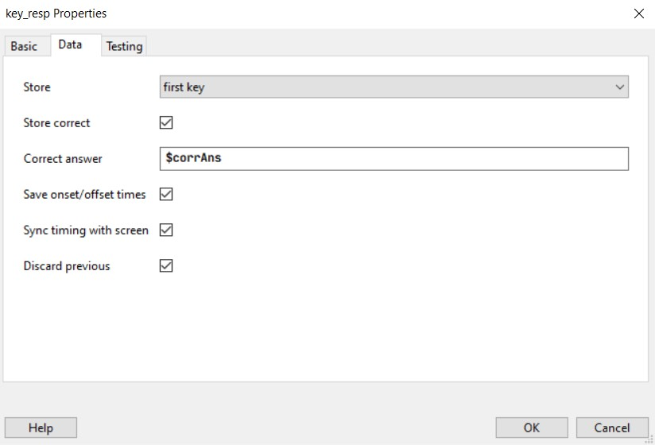
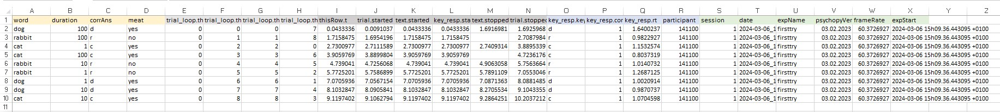
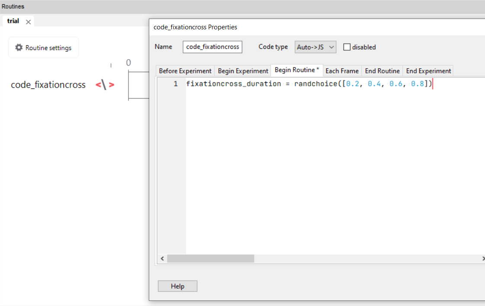
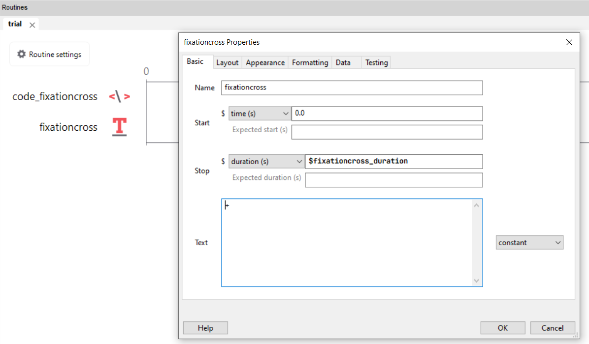
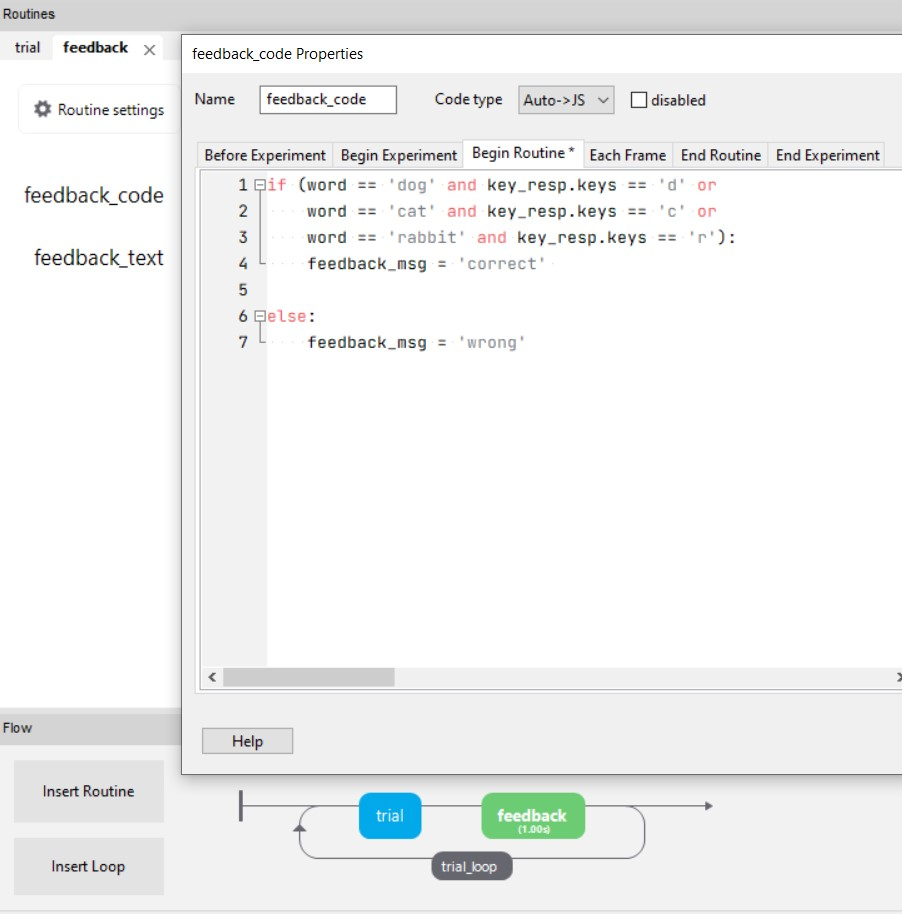
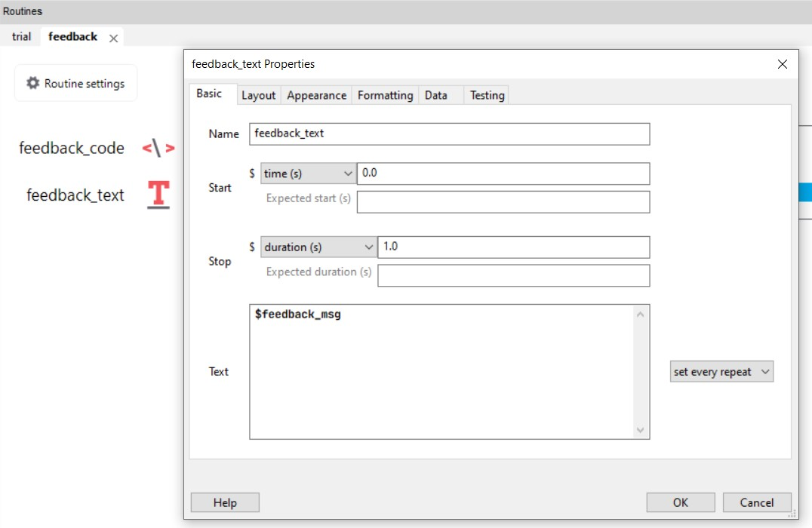

# Verhaltensexperimente mit PsychoPy

Kurze Einführung in unserem Experimenten und PsychoPy.

Wir können innerhalb dieses Kurses leider keine neurophysiologischen Daten erheben. Dieser Kurs legt also den Fokus auf verhaltenswissenschaftliche Forschung, die sich für die Gehirnprozesse von Menschen interessiert. Wir erstellen in PsychoPy das Experiment von [Dijkstra et al. (2022)](https://jov.arvojournals.org/article.aspx?articleid=2778583). Dieses Experiment ergibt Daten, wir in späteren Kursterminen zur psychometrischen Funktion und Signal Detection benutzen werden.

PsychoPy ist eine kostenfreie Software zum Erstellen von verhaltenswissenschaftlichen Experimenten im Labor oder Online. Die Software basiert auf der Programmiersprache Python. Man kann die Experimente (mit gewissen Begrenzungen) jedoch auch in einem GUI (graphical user interface) erstellen und braucht so (fast) keine Programmierkenntnisse. PsychoPy-Experimente ermöglichen präzise räumliche und zeitliche Kontrolle. [(Peirce et al. 2019)](https://link.springer.com/article/10.3758/s13428-018-01193-y)

<aside>Zu Beginn des Papers von [Peirce et al. 2019](https://link.springer.com/article/10.3758/s13428-018-01193-y) finden Sie eine kurze Übersicht über gängige Experimentalsoftware in den Verhaltenswissenschaften und was PsychoPy besonders macht. Auch weiterführende Informationen und Links sind hier zu finden.</aside>

In PsychoPy erstellen Experimente können direkt auf [Pavlovia](https://pavlovia.org/) hochgeladen, und so als Online-Experimente gehostet und durchgeführt werden. Die Speicherung des Experimentes auf *gitlab* ermöglicht dabei eine Versionskontrolle, sowie das Teilen des Experimentalcodes.

Wir erstellen zuerst ein einfaches Beispiel-Experiment.

## Umgebung

### Experiment-File erstellen und abspeichern

-   Öffnen Sie PsychoPy und speichern Sie in einem dafür erstellten Ordner (z.B. `psychopy_tutorial`) das Experiment-File ab (unter `experiment_tutorial`).

### Builder (GUI) und Coder?

Experimente können in PsychoPy mit dem Builder (in einem GUI) erstellt werden, der Python Code wird so automatisch für Sie generiert. Sie können sich diesen Code auch anschauen und verändern. Leider können Sie sobald Sie den Code verändert haben, diese Änderungen nicht zurück in den Builder übertragen. Im Builder-Modus können Sie aber Codestücke einfügen um einzelne Teile des Experiments in Python (oder anderen Programmiersprachen) zu programmieren und dennoch im Builder weiterarbeiten zu können.

<aside>Falls Sie planen ein Online-Experiment durchzuführen, eignet sich der Builder besonders, da die Experimente direkt online durchgeführt werden können.</aside>

## Experiment erstellen

### Stimuli

In PsychoPy finden Sie schon vorprogrammierte Stimulus Elemente, wie Gratings oder Rating Scales und können Texte, geometrische Figuren, Bilder und Filme einfügen. Auch komplexere Stimuluselemente wie Random Dots können sehr einfach konfiguriert werden ohne dass sie von Grund auf neu programmiert werden müssen.

-   Erstellen Sie einen **Stimulus**. Beachten Sie folgende Aspekte:

    -   Farbe

    -   Grösse

    -   weitere Eigenschaften, wie Bedingung/Kongruenz?

    -   Timing (Stimulusdauer, Stimulusende)

-   Notieren Sie, welche Eigenschaften des Stimulus sich über die Trials hinweg in unserem Experiment verändern sollte. Dies können auch mehrere Eigenschaften sein. Diese Liste benötigen Sie später.

### Trial

-   Ergänzen Sie alle Elemente, die für einen vollständigen Trial notwendig sind:

    -   Antwort der Versuchsperson / Response

    -   Inter-Trial-Intervall (ITI): kann vor oder nach dem Stimulus eingefügt werden. (Die Zeit des ITI wird oft variiert. Dies müsste also auch auf die Liste oben)

    -   Fixationskreuz?

    -   Mask?

    -   Feedback?

### Trialschleife

Sie müssen nicht alle Trials (oder in PsychoPy: `Routines`) des Experiments einzeln programmieren, sondern können diese wiederholen, in dem Sie eine **Trial**-Schleife (`loop`) um den Trial herum erstellen.

-   Erstellen Sie einen `loop`indem Sie im Feld `Flow` auf `Insert loop` klicken.

    -   Mit `loopType` können Sie steuern, die Bedingungen randomisiert/gemischt oder sequentiell/der Reihe nach angezeigt werden sollen.

    -   Mit `nReps` können Sie angeben, wie oft jeder Stimulus wiederholt werden soll. Haben Sie also einen Stimulus mit zwei zu varierenden Eigenschaften , welche je 3 Stufen haben (also 9 Zeilen im `conditions`-File und `nReps`= 2), ergibt das 18 Trials.

Mittels diesen Schleifen können die Bedingungen implementiert werden z.B. dass sich der Stimulus bei jedem Trial verändert. Dies kann mit einer `conditions`-Datei spezifiziert werden, idealerweise im `.csv` oder `.xlsx`-Format.

<aside>Die Endung `.csv` bedeutet, dass die Daten als *comma separated values* abgespeichert werden, also durch ein Komma getrennt. Dieses Dateiformat eignet sich besser als `.xlsx`, weil es mit vielen Programmen kompatibel und gut einlesbar ist.</aside>

*Beispielsweise wollen wir drei verschiedene Worte anzeigen (`dog`, `cat` und `rabbit`) und dieses Wort unterschiedlich lange anzeigen (Dauer: `1`, `10` und `100` Frames). Die Versuchspersonen sollen dann den Anfangsbuchstaben des Wortes drücken, also `d` für `dog`, `c` für `cat` und `r` für `rabbit`.*

-   Um die Bedingungen (in unserem Fall: die sich verändernden Stimuluseigenschaften) zu definieren, erstellen wir eine `.csv`oder `.xlsx`-Datei (z.B. in Excel/Notepad/etc.) mit dem Namen `conditions` und speichern dieses im selben Ordner wie das Experiment.

    -   Fügen Sie für jedes sich verändernde Element einen Variablennamen und die entsprechenden Werte ein (dies sind die Eigenschaften, die Sie sich bei Punkt 4.2.1 notiert haben). Die **Variablennamen** schreiben wir immer in die oberste Zeile der Datei.

        *Wenn wir z.B. einen Text anzeigen möchten, schreiben wir in die erste Zeile `word` und `duration`.*

    -   In die Spalte unter die Variablennamen schreiben wir die Werte.

        *Als Beispiel könnten die Worte die wir anzeigen lassen wollen `cat`, `dog` und `rabbit` lauten. Dann stehen in der Spalte `word`, diese 3 Wörter unter dem Variablennamen. Unter dem Variablennamen `duration` geben wir die Anzahl Frames ein, also `1`, `10` und `100`. Wir wollen jedes Wort mit jeder Dauer kombinieren. Das ergibt 9 Zeilen.*

    -   Fügen Sie in jeder Zeile unter dem Variablennamen `corrAns` die jeweils korrekte Antwort ein.

    -   Fügen Sie, falls vorhanden, in jeder Zeile weitere wichtige Information zum Stimulus ein.

        *Im Beispiel möchten Sie z.B. später fleischfressende mit pflanzenfressenden Tieren vergleichen, deshalb eine Spalte `meat`. Dies verändert im Experiment nichts, dient aber am Schluss zur Auswertung, weil diese Variable auch immer in den Datensatz geschrieben wird.*

    {width=50% fig-align="center"}

-   Fügen Sie nun im Loop-Fenster die `conditions`-Datei ein.

    {width=50% fig-align="center"}

::: {.callout-tip title="Tipp"}

Jede Zeile in der `conditions`-Datei unterhalb des Variablennamens entspricht einer Bedingung (condition).

Setzen Sie `nReps` auf 1 während Sie das Experiment erstellen, so sparen Sie Zeit.
:::

Im PsychoPy können Sie Variablen mit einem vorangestellten `$`einfügen.

-   Öffnen Sie nun wieder das Stimulusfenster und passen Sie dort die Stimuluseigenschaften an. Anstatt von *hard-coded values* (also einmalig, fix festgelegten Werten) geben wir nun einen Variablennamen ein. Der Stimulus darf nicht auf `constant` gesetzt sein, sonst kann er sich nicht Trial für Trial verändern, setzen Sie ihn deshalb unbedingt auf `set every repeat`.

    *In unserem Beispiel fügen wir bei `text` die Laufvariable (verändernde Eigenschaft) ein: `$word`. Die Anzeigedauer des Textes soll `$duration` in Frames sein.*

{width=50% fig-align="center"}

-   Lassen Sie das Experiment laufen und kontrollieren Sie, ob alles funktioniert hat.

::: {.callout-tip title="Tipp"}

Mit dieser Methode können Sie auch Instruktionen, ITIs, etc. variieren lassen.

:::

## Blockschleife

Neben Trial-Schleifen können Sie auch **Block-Schleifen** erstellen. Diese sind sinnvoll, wenn sich Bedingungen blockweise verändern (z.B. andere Instruktionen, andere Aufgaben, andere Stimulusarten).

Sie müssen also nicht jeden Block einzeln programmieren, sondern können eine **Block**-Schleife (`loop`) um mehrere Trials legen.

### Block-Loop erstellen

-   Erstellen Sie im Feld `Flow` eine neue Schleife mit `Insert loop`.
-   Diese Schleife soll **alle Trials eines Blocks umfassen** (also um die Trial-Schleife herum liegen).

### Einstellungen der Block-Schleife

-   Mit `loopType` können Sie steuern, ob die Blöcke randomisiert/gemischt oder sequentiell/der Reihe nach angezeigt werden sollen.
-   Mit `nReps` können Sie angeben, wie oft jeder Block wiederholt werden soll.

### Block-Bedingungen über eine `conditions`-Datei steuern

Analog zur Trial-Schleife können Sie auch für Blöcke eine `.csv`- oder `.xlsx`-Datei verwenden.

Erstellen Sie z.B. eine Datei `block_conditions.csv` im selben Ordner wie das Experiment.

In die erste Zeile kommen die **Variablennamen**, z.B.:

``` csv
blockN,instructionText
```

Darunter stehen die Werte für jeden Block (jede Zeile entspricht einer Bedingung):

``` csv
1,"Reagieren Sie so genau wie möglich."
2,"Reagieren Sie so schnell wie möglich."
```

Fügen Sie im Block-Loop-Fenster diese Datei im Feld `conditions` ein.

### Variablen im Experiment verwenden

Im PsychoPy können Sie Variablen mit einem vorangestellten `$` einfügen.

-   Öffnen Sie die Instruktions-Routine am Anfang jedes Blocks.

-   Ersetzen Sie festen Text durch:

    `$instructionText`

-   Setzen Sie den Parameter unbedingt auf:

    `set every repeat`

Damit wird bei jedem neuen Block automatisch die passende Instruktion geladen.

### Unterschiedliche Trial-Dateien pro Block verwenden

Sie können blockweise unterschiedliche Trial-Dateien verwenden.

Erstellen Sie dazu eine zweite Datei mit dem Namen `conditions2.csv`.

Beispiel:

``` csv
word,duration,corrAns
DOG,1,d
DOG,10,d
DOG,100,d
CAT,1,c
CAT,10,c
CAT,100,c
RABBIT,1,r
RABBIT,10,r
RABBIT,100,r
```

-   Öffnen Sie die **Trial-Loop**, die innerhalb der Block-Loop liegt.

-   Tragen Sie im Feld `conditions` ein:

    `$trialFile`

Damit kann jeder Block eine andere Trial-Datei laden (z.B. `conditions.csv` im ersten Block und `conditions2.csv` im zweiten Block).

### Antworten aufnehmen

In PsychoPy muss definiert werden, wie die Antwort der Versuchsperson aufgenommen wird. Dies kann mit der Maus, der Tastatur oder anderen Devices umgesetzt werden. Die Möglichkeiten sehen Sie unter `Responses`.

-   Fügen Sie eine **Antwortkomponente** hinzu und benennen Sie diese sinnvoll.

    *In unserem Beispiel möchten wir, dass die Versuchsperson mittels Keyboard antwortet.*

    -   Mit `Force end of Routine` können Sie einstellen, ob eine Antwort den Trial beendet und mit dem nächsten fortfährt.

    -   Der Namen der Antwortkomponente wird später im Datensatz als Variable zu finden sein.

        *Werden in einer Antwortkomponente namens `key_resp` mittels Tastendruck Antwort* und *Response Time* aufgenommen, heissen die Variablen dann `key_resp.keys`(gedrückte Taste) und `key_resp.rt` (Antwortdauer).

    -   Entscheiden Sie, ob PsychoPy überprüfen soll, ob die richtige Antwort gegeben wurde.

        *Wenn Sie dies möchten, gleicht PsychoPy in unserem Beispiel die gegebene Antwort (`key_resp.keys`) mit der dafür eingegebenen Variable (hier `corrAns`) ab. Stimmen diese überein, fügt es in die Variable `key_resp.corr` 1 ein, wenn nicht 0).*

    -   Mit `first key` definieren Sie, dass der erste Tastendruck zählt.

    {width=50% fig-align="center"}

    {width=50% fig-align="center"}

### Weitere Elemente

In PsychoPy GUI wird Ihnen im Fenster `Flow` eine Art Flowchart angezeigt. Hier sehen Sie, welche Elemente Ihr aktuelles Experiment enthält.

-   Fügen Sie nun weiteren Elemente, z.B.

    -   Begrüssung

    -   Einverständnis

    -   Instruktion

    -   Debriefing, Verabschiedung

-   Lassen Sie das Experiment laufen und kontrollieren Sie, ob alles funktioniert hat.

::: {.callout-tip title="Tipp: Zwischenschritte"}

Beim Programmieren lohnt es sich oft, die kleinen Schritte zwischenzutesten, weil es dann einfacher ist herauszufinden, wo genau der Fehler passiert ist.
:::

## Datenspeicherung

Wenn man die default-Einstellungen nicht ändert, speichert PsychoPy die Daten automatisch in einer trial-by-trial `.csv`-Datei. Das bedeutet, dass jeder Trial 1 Zeile generiert. Die `.csv`-Datei erhält einen Namen, der sich aus der *Versuchspersonen-ID*, dem *Namen des Experiments*, und dem aktuellen *Datum inkl. Uhrzeit* zusammensetzt. So ist es möglich, mit derselben Versuchspersonen-ID beliebig oft das Experiment zu wiederholen. Die `.csv`-Dateien werden in einem Ordner mit dem Name **data** abgelegt.

In den Fenstern der Elemente kann jeweils angegeben werden, was alles gespeichert werden soll.

::: {.callout-tip title="Tipp: Naming"}

Bei der Wahl vom Datenfile-Namen empfiehlt es sich **immer** Datum und Uhrzeit anzuhängen. Dies verhindert, dass Daten überschrieben werden, wenn z.B. eine Versuchspersonen-ID falsch eingetippt oder doppelt vergeben wird.
:::

*Das oben verwendete Beispielsexperiment ergibt folgenden Datensatz:*

{fig-align="center"}

Sie sehen die Infos aus der `conditions`-Datei (gelb), die Zählerinformationen der Loops (hellgrau), die Timinginformationen (dunkelgrau), die Antwortinformationen (blau) und die Experimentinformationen (grün).

## Test / Pilotierung

-   Führen Sie das Experiment aus und schauen Sie sich den Datensatz an: Sind alle wichtigen Informationen auf jeder Zeile vorhanden?

    -   Versuchspersonen-ID

    -   Bedingung

    -   Stimuluseigenschaften (z.B. word)

    -   Antwort der Versuchsperson

    -   Antwortdauer der Versuchsperson

    -   Antwort korrekt?

-   Können die Daten überschrieben werden?

-   Lassen Sie jemanden anderes Ihr Experiment durchführen, und geben Sie einander Feedback.

## Verwenden von Codekomponenten im Builder

Auch wenn man das Experiment im Builder erstellt erfordern einige Experimentelemente das Verwenden von **Codekomponenten**. In diesem Abschnitt werden zwei häufige Anwendungsbeispiele besprochen: Die variable Blockdauer (z.B. für Fixationskreuze oder ITIs) und das Geben von Feedback (z.B. in einem Übungsdurchgang).

::: callout-tip
### If-else Statements in Python

In Python können Sie für verschiedene Fälle (`cases`) andere Aktionen ausfüllen, indem Sie If-else Statements nutzen.

Ein If-else Statement enthält ein `if` (*wenn*), einer `condition` (*das zutrifft*), einem `body` (*dann mach das*).

Ergänzt kann dies werden mit `ifelse` (*oder wenn*)+ `condition` (*das zutrifft*) + `body` (*dann mach das*) und einem `else` (*wenn nichts davon zutrifft*) + `body` (*dann mach das*).

**Wichtig:** - Python ist *indentation-sensibel*, das bedeutet: Die Einrückung (1 Tab) muss stimmen, sonst funktioniert der Code nicht. Auch der *Doppelpunkt* `:` ist wichtig und muss an der richtigen Stelle stehen. Wenn Sie mehrere `conditions` verwenden möchten, müssen Sie diese in *Klammern* `()` setzen. Hier sehen Sie die Syntax eines If-else Statements:

```         
if (condition):
    body
    
elif (condition):
    body
    
else:
    body
```
:::

<aside>Einführung in Python auf Datacamp: 👉🏼 [Introduction to Python](https://app.datacamp.com/learn/courses/intro-to-python-for-data-science)</aside>

### Variable Dauer von Elementen

#### Fixationskreuz und ITI mit randomisierter Dauer

Um das Experiment für die Versuchsperson unvorhersehbarer zu machen, implementieren wir vor dem eigentlichen Stimulus ein Fixationskreuz mit variabler Länge. Diese Länge soll 0.2, 0.4, 0.6, oder 0.8 Sekunden betragen.

-   Fügen Sie einen Codeblock `code_fixationcross` ein und definieren Sie unter `Begin Routine` die Variable `fixationcross_duration`.

    {width=50% fig-align="center"}

-   Fügen Sie einen Textblock `fixationcross` ein mit dem Text `+` und Schriftgrösse `10`. Geben Sie unter `duration` Ihre vorher definierte Variable ein (vergessen Sie dabei das `$` nicht): `$fixationcross_duration`.

    {width=50% fig-align="center"}

::: {.callout-caution title="Hands-on: Variable ITI einbauen"}

Fügen Sie nach dem Stimulus eine ITI mit variabler Dauer hinzu.

**Einfachere Variante:** Die ITI soll 10, 20, 30, 40 oder 50 Frames betragen.

**Schwierigere Variante:** Die ITI soll eine Zufallszahl zwischen 0.2 und 0.8 Sekunden betragen.
:::

### Feedback

Es gibt Experimente, welche Feedback erfordern. Oft wird vor der Datenerhebung ein Übungsblock eingebaut, welcher Feedback enthält, so dass die Versuchspersonen wissen, ob sie den Task richtig verstanden haben.

-   Erstellen Sie zuerst eine [Trialschleife](https://kogpsy.github.io/neuroscicomplabFS24/pages/chapters/psychopy_experiments.html#trialschleife) mit einem Stimulus und einer Response.

-   Fügen Sie nach dem Stimulus und der Antwort (aber innerhalb der Trialschleife!) eine Routine `feedback` ein.

-   Fügen Sie innerhalb der Routine `feedback` eine **Codekomponente** hinzu. In dieser Komponente können Sie nun

    {width=50% fig-align="center"}

-   Fügen Sie nun eine **Textkomponente** hinzu und fügen Sie beim Textfeld die Variable `$response_msg` ein, damit die Versuchsperson abhängig von ihrer Antwort das entsprechende Feedback erhält, welches zuvor in der Codekomponente definiert wurde.

    {width=50% fig-align="center"}

::: {.callout-caution title="Hands-on: Feedback geben"}

Sie können mittels einer **Codekomponente** auch reagieren, wenn die Versuchsperson zu schnell, zu langsam oder gar nicht antwortet.

-   Erstellen Sie einen Übungsdurchgang. Fügen Sie eine Code-Komponente hinzu und legen Sie fest, welches Feedback die Versuchsperson erhalten soll.

**Einfache Variante:** Geben Sie der Person Feedback, ob ihre Antwort richtig oder falsch war.

**Mittelschwere Variante:** Geben Sie der Person Feedback, wenn Sie zu schnell oder zu langsam antwortet.

**Schwere Variante:** Erstellen Sie einen Counter, welcher der Versuchsperson anzeigt, wie gut sie ist, indem für jede richtige Antwort 5 Punkte erhält, für jede falsche Antwort 5 Punkte abgezogen werden.

Falls Sie zur Geschwindigkeit Rückmeldung geben wollen oder einen Counter bauen, können Sie etwas in dieser Art machen.

```         
if dots_keyboard_response.keys is None:
    response_text = "miss"

elif dots_keyboard_response.rt <= 0.1:
    response_text = "too fast"

else:
    if (direction == "left" and dots_keyboard_response.keys == "f" or 
        direction == "right" and dots_keyboard_response.keys == "j"):
        response_text = "+5 points"
    else:
        response_text = "+0 points"
    
```
:::

## Weitere wichtige Punkte

### Degrees of Visual Angle

Oftmals werden Grössenangaben von Stimuli noch in Pixel oder Zentimeter, sondern in *degrees of visual angle* gemacht. Dies hat den Vorteil, dass die Angaben nicht vom Monitor selber oder der Entferung vom Monitor abhängig sind. *Degrees of visual angle* gibt die wahrgenommene Grösse des Stimulus an, und berücksichtigt die Grösse des Monitors und des Stimulus, und die Entfernung der Versuchsperson vom Monitor. Weitere Informationen dazu finden Sie auf der Website von [OpenSesame](https://osdoc.cogsci.nl/3.3/visualangle/). Üblicherweise entspricht ein *degrees of visual angle* etwa einem cm bei einer Entfernung von 57 cm vom Monitor.

<aside>[OpenSesame](https://osdoc.cogsci.nl/) ist ein weiteres, Python-basierendes Programm für die Erstellung behavioraler Experimente.</aside>

Zur Umrechnung zwischen cm und *degrees of visual angle* finden Sie unter diesem [Link](https://www.sr-research.com/eye-tracking-blog/background/visual-angle/) mehr Information.

### Timing

**Frames vs. time (sec or ms)**: Die präziseste Art zur Steuerung des Timings von Stimuli besteht darin, sie für eine festgelegte Anzahl von Frames zu präsentieren. Bei einer Framerate von 60 Hz können Sie Ihren Stimulus nicht z. B. 120 ms lange präsentieren; die Bildperiode würde Sie auf einen Zeitraum von 116,7 ms (7 Bilder) oder 133,3 ms (8 Bilder) beschränken. Dies ist besonders wichtig für Reaktionszeit-Aufgaben und EEG-Studien, wo ein präzises Millisekunden-Timing erforderlich ist. Hier finden Sie weitere Informationen zu diesem Thema: [Presening Stimuli - Psychopy](https://www.psychopy.org/coder/codeStimuli.html).

<aside>Hertz ist eine Einheit die angibt, wie häufig etwas pro Sekunde passiert. Hertz kann wie *Mal pro Sekunde* ausgesprochen werden. 60 Hertz bedeutet also, 60 Mal pro Sekunde.</aside>

### Individualisierte Aufgabenschwierigkeit / Schwellenmessung

In PsychoPy kann ein Staircase in einem Loop verwendet werden, um die Schwierigkeit einer Aufgabe basierend auf der Leistung der Teilnehmer dynamisch anzupassen. Sie ist besonders häufig in Experimenten zur Schwellenmessung, bei denen das Ziel darin besteht, die kleinste wahrnehmbare Reizintensität zu bestimmen. Hier finden Sie weitere Informationen zu diesem Thema: [Using a Staircase - PsychoPy](https://www.psychopy.org//general/staircases.html).

::: {.callout-caution title="Hands-on: Experiment programmieren"}

Schauen Sie sich Ihre Flowchart von das Dijkstra et al. (2022) Paper an.

1.  Erstellen Sie die main trials (keine Übungstrials) des Experiments in PsychoPy. Wir benutzen hier keine dynamischen Stimuli, sondern statische Gabor Gratings (und Noise). Diese sind im img_tutorial Ordner gespeichert.

2.  Erstellen Sie eine Block-Schleife (Loop) und sorgen Sie dafür, dass sich die Instruktionen zu Beginn jedes Blocks automatisch aktualisieren (anhand einer .csv oder .xlsx Datei). In dieser Block-Datei sollen Sie zusätzlich festlegen, welche Trial-conditions-Datei in der Trial-Loop verwendet wird (z.B. über eine Spalte trialFile). Wir erstellen dabei nur zwei Blöcke: (1) IMAGINE RIGHT, DETECT RIGHT und (2) IMAGINE RIGHT, DETECT LEFT.
Dafür benötigen Sie:

Eine Block-Datei (z.B. block_conditions.csv/.xlsx) mit (a) Instruktionstext und (b) dem Namen der zu ladenden Trial-Datei pro Block.

Zwei Trial-Dateien:

- trials_block_1: Trial-Datei mit RIGHT-Gratings über die verschiedenen Visibility-Level

- trials_block_2: Trial-Datei mit LEFT-Gratings über die verschiedenen Visibility-Level

3.  Wenn Sie genügend Zeit haben können Sie auch noch Übungstrials einbauen.

:::

::: {.callout-tip title="Tipp: Hilfreiche Ressourcen"}

Hilfreiche Informationen zum Erstellen von Experimenten in PsychoPy finden Sie hier:

-   [PsychoPy Website](https://www.psychopy.org/)

-   [Walk-through: Builder](https://tu-coding-outreach-group.github.io/cog_summer_workshops_2021/psychopy/index.html)

-   [Diskussionsforum](https://discourse.psychopy.org/)
:::
